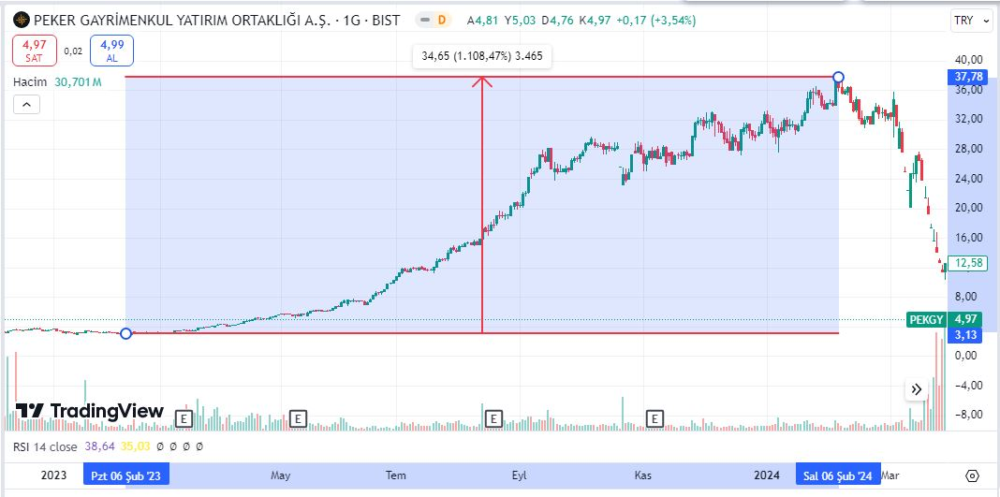
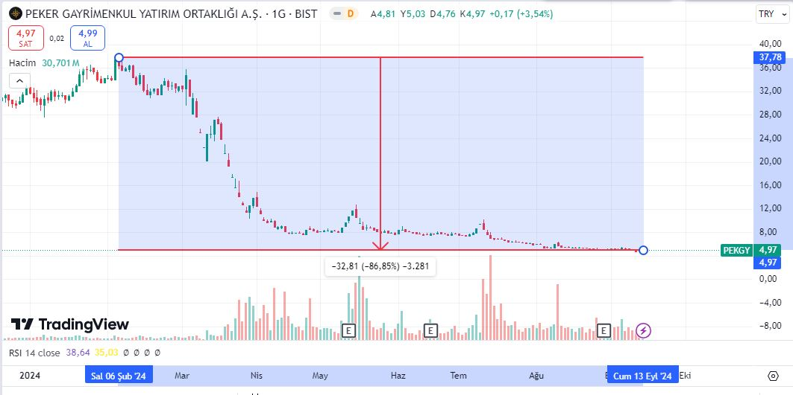
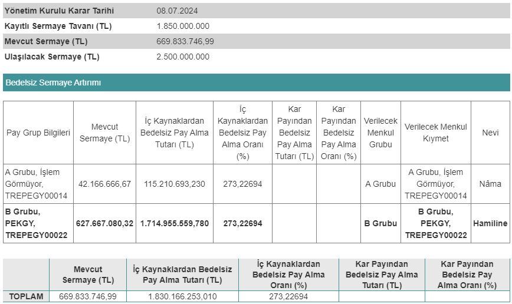

Borsa İstanbul'da yılbaşından bu yana en çok değer kaybeden hissesi belli oldu. Peker GYO, 1 yıllık periyotta yüzde 1108 değerlenmişti. Hisse, zirve fiyatından yüzde 87 düşüş gösterdi. Yatırımcıların 1000 TL'si 130 TL'ye geriledi.

### **1 YILDA %1108 YÜKSELMİŞTİ!**

Peker Gayrimenkul Yatırım Ortaklığı A.Ş.'nin Borsa İstanbul'da işlem gören payları, 6 Şubat 2023 - 6 Şubat 2024 tarihleri arasında yükseliş rekorları kırdı. Hisse, bu tarihler arasında 3,13 TL'den tam 37,78 TL'ye yükseldi. Bu yükseliş ile birlikte %1108 değerlenen PEKGY payları, yatırımcılarının ceplerini doldurmuştu.

### **HİSSE ADETA ERİDİ**

Tarihi zirve fiyatlarından düşüşe geçen Peker GYO payları, son aylarda düşüşü hızlandırdı. Borsa İstanbul'daki genel değer kaybına da ayak uyduran PEKGY, 13 Eylül 2024 tarihli seansı 4,97 TL'den kapattı. Hissedeki düşüş zirve fiyattan %87 oldu. Hissenin zirve fiyatından 1000 TL'lik alım yapan bir yatırımcının parası 130 TL'ye kadar gerilemiş oldu.

### **BEDELSİZ BAŞVURUSU ONAY BEKLİYOR!**

Peker GYO, 08.07.2024 tarihinde bedelsiz sermaye artırımı kararı aldı. Şirket, %273,22 oranında bedelsiz için Sermaye Piyasası Kurulu'ndan onay bekliyor. SPK'nın bedelsiz sermaye artırımına onay vermesi durumunda, PEKGY hisse fiyatında bölünmeye gidilecek ve yatırımcılara bedelsiz pay  dağıtımı yapılacak.

