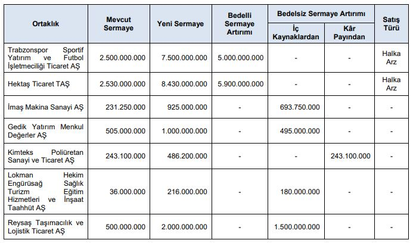

Sermaye Piyasası Kurulu, 12 Eylül 2024 tarihli bülteni yayımladı. SPK'nın yayımladığı bültende halka arz çıktı mı? 16-20 Eylül haftasında yeni halka arz var mı? İşte detaylar!

Sermaye Piyasası Kurulu (SPK), 2024 yılında şimdiye dek 30 şirkete halka arz onayı verdi. SPK'dan onay alarak halka arz edilen son şirket ise Durukan Şekerleme oldu. Şirket, toplam 42.500.000 lotu hisse başı 17 TL'den halka arz etti.

Son aylarda gerçekleştirilen halka arz şirketler yatırımcılarına bir miktar para kazandırdı. Halka arz hisselerinin yükselişi, yatırımcıları yeniden bu piyasaya çekmeye başladı. 16-20 Eylül haftasının halka arzları da merak edilerek araştırılıyor.

### **16-20 EYLÜL HALKA ARZ TAKVİMİ**

Sermaye Piyasası Kurulu, 12 Eylül 2024 tarihinde bülten yayımladı. Yayımlanan bültende yeni halka arz yer almadı. SPK'dan onay çıkmaması sebebiyle önümüzdeki hafta yeni halka arz olmayacak.

Geçtiğimiz hafta halka arz edilen Durukan Şekerleme payları ise DURKN kodu ile 17 Eylül 2024 Salı günü Borsa İstanbul'da işlem görmeye başlayacak. DURKN hisseleri, BIST Ana Pazar'da işlem görecek.

SPK, 12 Eylül tarihli bültende tam 7 şirkete sermaye artırımı onayı verdi. 2 şirket bedelli, 5 şirket ise bedelsiz sermaye artırımı gerçekleştirecek.