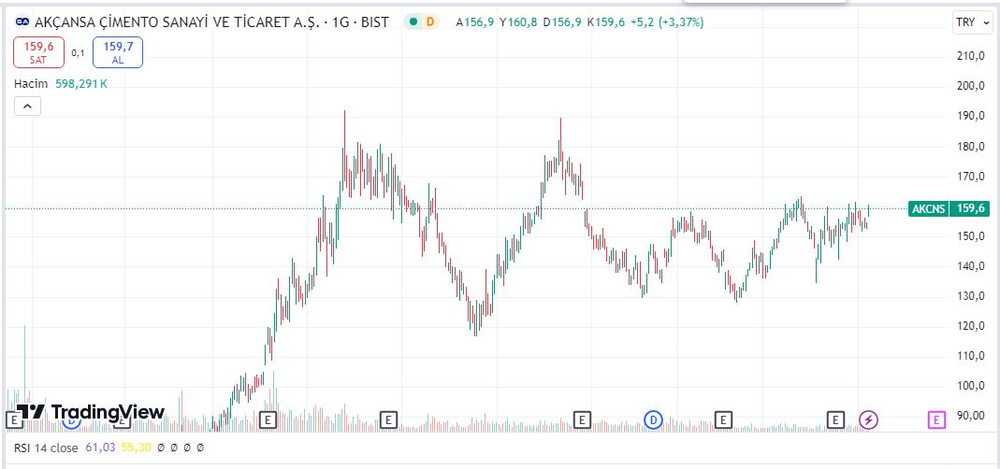

Borsa İstanbul'un çimento şirketlerinden Akçansa Çimento (AKCNS) hisseleri için yeni hedef fiyat açıklandı. AKCNS hedef fiyat detayları haberimizde!

Borsa İstanbul pay piyasasının önde gelen şirketlerinden Akçansa Çimento (AKCNS), inişli çıkışlı grafiğini sürdürüyor. Geçtiğimiz aylarda, şimdiye kadarki tarihi zirve fiyatlarını gören AKCNS, daha sonra düşüşe geçmişti. Hissede toparlanma sinyalleri devam ederken, yatırımcılar da hissenin geleceği konusunda araştırmalara devam ediyor.

AKCNS hissesi hakkında yatırım şirketleri ve aracı kurumlardan da zaman zaman analizler paylaşılıyor. Son olarak İŞ Yatırım, Akçansa Çimento (AKCNS) hisseleri için yeni hedef fiyat açıklamasında bulundu.

## **AKCNS HEDEF FİYAT**

İş Yatırım, 09.09.2024 tarihinde Akçansa Çimento (AKCNS) hissesi için 225,69 TL hedef fiyat açıkladı. Paylaşılan raporda hisse için 'al' tavsiyesinde bulunuldu. Akçansa hisselerinin potansiyel getirisi ise %40,97 şeklinde gerçekleşti.

### **AKCNS HİSSE YORUMU**

İş Yatırım, Akçansa Çimento (AKCNS) hisseleri için 225,69 TL hedef fiyat ve %40,97 potansiyel getiri açıklayarak, yatırımcılara alım fırsatı sundu. Geçmişte tarihi zirvelerini gören ancak sonrasında düşüş yaşayan AKCNS hisseleri, toparlanma sinyalleri vermeye devam ediyor. İş Yatırım’ın 'al' tavsiyesi, şirketin gelecekteki performansının güçlü olacağına dair beklentileri yansıtıyor ve hissede önemli bir büyüme potansiyeline işaret ediyor.