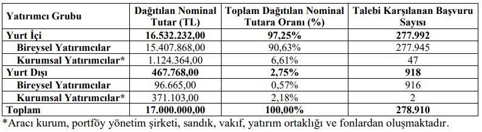

Bin Ulaşım ve Akıllı Şehir Teknolojileri A.Ş. (BinBin) halka arz sonuçları açıklandı. Şirketin halka arzına öncekilere kıyasla oldukça az katılım oldu. BinBin halka arzında toplam 278 bin 910 yatırımcıya dağıtım gerçekleştirildi.

Şirketin halka arz sonuçlarına ilişkin açıklamasında şu ifadelere yer verildi:

"Bin Ulaşım ve Akıllı Şehir Teknolojileri A.Ş. (“Bin Ulaşım” veya “Şirket”) paylarının halka arzında “Borsa’da Satış - Sabit Fiyatla Talep Toplama ve Satış Yöntemi” ile 03 – 04 Ekim 2024 tarihlerinde 1 TL nominal değerli pay için 91,85 TL’den talep toplanmıştır.

Halka arzda sermaye artışı yoluyla 12.000.000 TL ve ortak satışı yoluyla halka arz edilen 5.000.000 TL nominal değerli payların tamamı satılmıştır. Toplam halka arz büyüklüğü 1.561.450.000 TL olarak gerçekleşmiştir.

Halka arzın Borsa İstanbul Birincil Piyasa’da “Borsa’da Satış-Sabit Fiyatla Talep Toplama ve Satış” yöntemi ile yapılmış olması sebebiyle yatırımcı grubu bazında tahsisat yapılmamıştır.

Borsa İstanbul tarafından paylaşılan verilere göre; halka arzda toplam filtre edilmemiş veriler baz alındığında 281.468 adet emir ile satışa sunulan adedin 1,40 katına tekabül eden 23.873.972 adet nominal değerli paylar için 2.192.824.328,20 TL tutarlı talep gelmiştir.

Dağıtım sonucunda 278.910 adet yatırımcıya 17.000.000 TL nominal değerli payların satışı gerçekleştirilmiştir."

