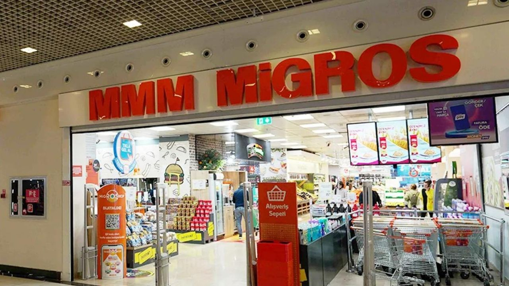
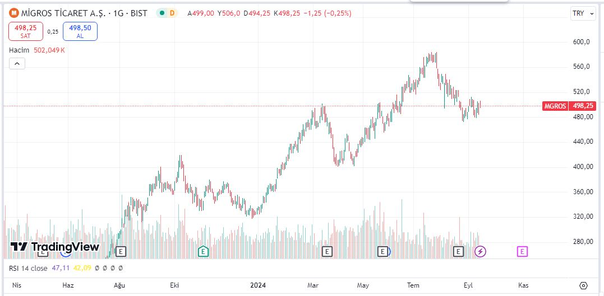

Borsa İstanbul'da işlem gören hisseler için hedef fiyat açıklamaları gelmeye devam ediyor. Migros Ticaret (MGROS) hisselerine de yeni hedef fiyat verildi. İşte detaylar!

Borsa İstanbul pay piyasasının önde gelen şirketlerinden Migros Ticaret A.Ş. (MGROS), geçtiğimiz günlerde 2024 yılının 2. çeyrek bilançosunu açıklamıştı. 2023 yılının ilk 6 ayında 109,03 milyar TL hasılat açıklayan Migros, 2024/6 bilançosunda bu rakamı yaklaşık %11 artırdı ve 121,1 milyar TL hasılat duyurdu. 

Şirketin net dönem kârı ise yaklaşık %64 oranında düşmüştü. Geçen yılın 2. çeyrek bilançosunda 5,37 milyar TL net dönem kârı duyuran Migros, bu yılın aynı döneminde ise 1,95 milyar TL net kâr açıkladı. Şirketin bilançosunun ardından hedef fiyat açıklamaları da peş peşe geldi.

## **MİGROS (MGROS) HEDEF FİYAT**

Deniz Yatırım, 13.09.2024 tarihinde Migros (MGROS) hissesi için 774,90 TL hedef fiyat açıkladı. Kurum'un verdiği hedef fiyata göre MGROS potansiyel getirisi yaklaşık %56 oldu. Deniz Yatırım'ın MGROS tavsiyesi ise 'AL' şeklinde belirtildi.

