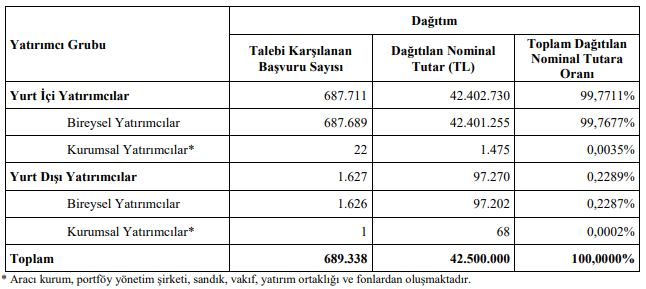

Durukan Şekerleme halka arz sonuçları açıklandı. Tamamen eşit dağıtım yöntemi uygulanan halka arzda, toplam 689 bin 338 yatırımcıya dağıtım gerçekleştirildi.

Durukan Şekerleme halka arzında toplam 42.500.000 lot satışa sunulmuştu. Borsa İstanbul birincil piyasada halka arz edilen Durukan Şekerleme, tamamen eşit dağıtım yöntemi uyguladı. 11-12 Eylül tarihlerinde talep toplama işlemlerini tamamlayan Durukan Şekerleme'nin halka arz sonuçlarına ilişkin tüm detaylar açıklandı.

Halka arza katılan yatırımcılara, kişi başı maksimum 68 lot dağıtıldı. 

Şirketin halka arz sonuçlarına ilişkin açıklamasında şu ifadeler yer aldı:

***"Durukan Şekerleme Sanayi ve Ticaret A.Ş. halka arzında “Borsa’da Satış - Sabit Fiyatla Talep Toplama ve Satış Yöntemi” ile 11 – 12 Eylül 2024 tarihlerinde 1 TL nominal değerli pay için 17,00 TL’den talep toplanmıştır.***

***Halka arzda sermaye artışı yoluyla halka arz edilen 32.500.000 TL ve ortak satışı yoluyla halka arz edilen 10.000.000 TL nominal değerli payların tamamı satılmıştır. Toplam halka arz büyüklüğü 722.500.000 TL olarak gerçekleşmiştir.*** 

***Borsa İstanbul Birincil Piyasa’da “Borsa’da Satış-Sabit Fiyatla Talep Toplama ve Satış” yöntemi ile yapılan halka arzda yatırımcı grubu bazında tahsisat yapılmamıştır.***

***Borsa İstanbul tarafından paylaşılan verilere göre; halka arzda toplam filtre edilmemiş veriler baz alındığında 698.198 adet emir ile satışa sunulan adedin 3.27 katına tekabül eden 138.935.808 adet nominal değerli paylar için 2.639.780.352,00 TL tutarlı talep gelmiştir.***

***Dağıtım sonucunda 689.338 adet yatırımcıya 42.500.000 TL nominal değerli payların satışı gerçekleştirilmiştir. Halka arz fiyatı üzerinden dağıtım tutarları yatırımcı grubu bazında aşağıdaki tabloda sunulmaktadır."***

