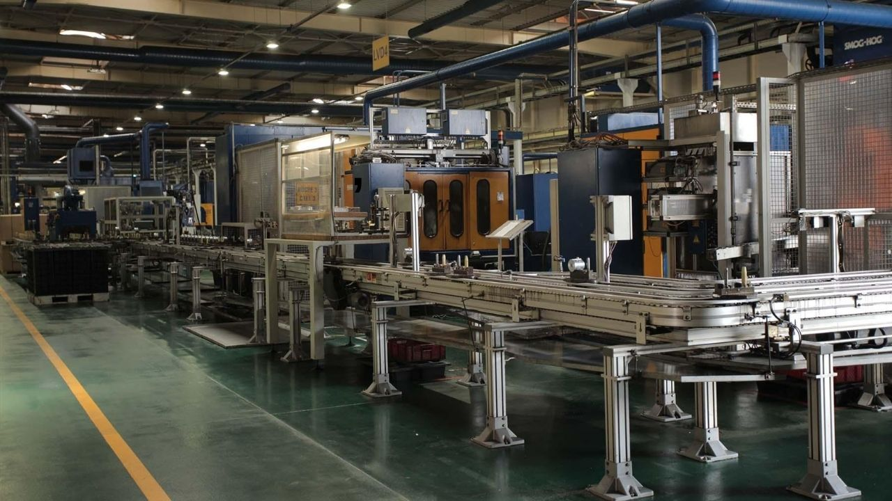

Federal-Mogul İzmit Piston (FMIZP) katılım endeksine uygun mu? FMIZP hisse caiz mi, helal mi?

Federal-Mogul İzmit Piston, 1998 yılında kurulan ve otomotiv sektörüne yönelik piston üretimi yapan bir tesistir. Dünya çapında faaliyet gösteren Federal-Mogul Corporation'ın bir parçası olan bu tesis, özellikle içten yanmalı motorlarda kullanılan pistonların üretiminde uzmanlaşmıştır. Gelişmiş üretim teknolojileri ve kalite standartlarına sahip olan Federal-Mogul İzmit Piston, hem yurt içi hem de yurt dışı pazarlara hizmet vermektedir.

Federal-Mogul İzmit Piston (FMIZP), 31.07.1990 tarihinde halka arz edilerek Borsa İstanbul'da işlem görmeye başlamıştır. Şirket son zamanlarda yatırımcılar tarafından katılım endeksine uygun olup olmadığı konusunda araştırılmaktadır. 

## **FMIZP KATILIM ENDEKSİ**

Federal-Mogul İzmit Piston (FMIZP), Borsa İstanbul'un son açıklamasına göre katılım finans ilkelerini karşılamaktadır ve BIST Katılım Endeksi'ne uygundur. FMIZP hissesinin caiz hisse hassasiyeti olanlar için uygun olduğu değerlendirilmektedir.

### **FMIZP HANGİ ENDEKSTE?**

Federal-Mogul İzmit Piston (FMIZP) hisseleri Borsa İstanbul'da BIST Tüm, BIST Ana, BIST Kocaeli, BIST KOBİ Sanayi, BIST Katılım Tüm, BIST 500, BIST Sınai, BIST Metal Eşya, Makina ve BIST Tüm-100 endekslerine dahildir.