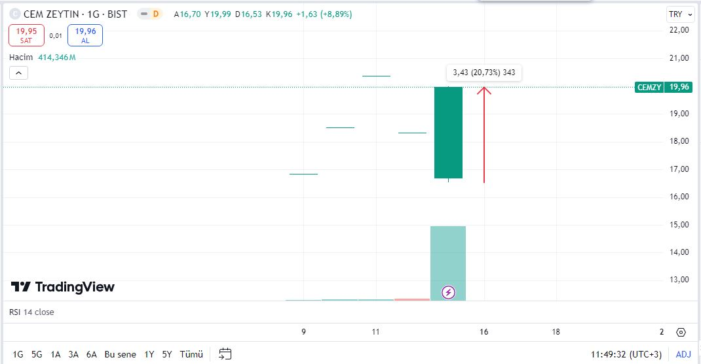

Halka arzın yeni şirketlerinden Cem Zeytin (CEMZY), 13 Eylül tarihli seansta taban fiyatı görmüştü. Aracı kurumlardan gelen yüklü alımlar sonrası hisse günü tavan fiyata yakın kapattı.

Borsa İstanbul pay piyasasında işlem görmeye başlayan Cem Zeytin, halka arz sonrası yatırımcılarına kazandırmaya devam ediyor. Borsa yolculuğunu peş peşe 3 tavan ile başlayan CEMZY hisseleri, 4. gün ise taban olmuştu. Daha sonraki seansı da tabandan açan CEMZY, kapanışı sert yükselişle yaptı.

### **TEK SEANSTA %21 KAZANDIRDI!**

Cem Zeytin'in hisseleri, 13 Eylül tarihli seansta 16,53 TL'ye kadar geriledi. Seans kapanışına yakın saatlerde yükselişe geçen hisse, günü 19,96 TL'den kapattı. Cem Zeytin hisselerine günün en düşük fiyatından giriş yapan yatırımcılar, tek seansta %21 kazanç sağladı.

### **5 KURUMDAN YÜKLÜ ALIM!**

Oyak Yatırım, Cem Zeytin tahtasında öne çıkan aracı kurum oldu. Yalnızca son seansta CEMZY hisselerine Oyak Yatırım üzerinden 15,68 milyon lot alım yapıldı. Alıcılar tarafında Oyak Yatırım'ı 5 milyon lot ile Yatırım Finansman, 4,65 milyon lot ile Vakıf Yatırım, 4,51 milyon lot ile Şeker Yatırım ve 2,7 milyon lot ile de Osmanlı Yatırım takip etti.