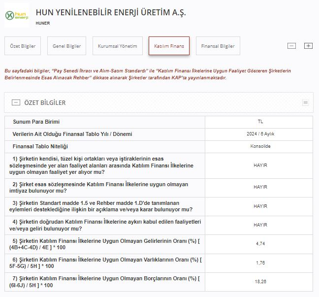

Hun Yenilenebilir Enerji, 2014 yılında Türkiye’nin enerji sektöründe sürdürülebilir ve çevre dostu çözümler üretmek amacıyla kurulmuştur. Şirket, özellikle güneş ve rüzgar enerjisi gibi yenilenebilir enerji kaynaklarına yönelik projeler geliştirerek, Türkiye’nin enerji ihtiyacına çevreci alternatifler sunmaktadır.

Hun Yenilenebilir Enerji (HUNER), 21.02.2022 tarihinde halka arz edilerek Borsa İstanbul'da işlem görmeye başlamıştır. Şirket son zamanlarda birçok yatırımcı tarafından katılım endeksi konusunda araştırılmaktadır. HUNER hisseleri, Borsa İstanbul'un BIST Yıldız, BIST Tüm, BIST İstanbul, BIST 500, BIST Hizmetler, BIST Katılım Tüm, BIST Tüm-100 ve BIST Elektrik endekslerine dahildir.

### **HUNER KATILIM ENDEKSİ**

Hun Yenilebilir Enerji (HUNER), Borsa İstanbul tarafından yapılan son açıklamaya göre katılım finans ilkelerini karşılamakta ve BIST Katılım Endeksi'ne uygundur. HUNER hisselerinin caiz hisse arayışında olanlar için uygun olduğu değerlendirilmektedir.

