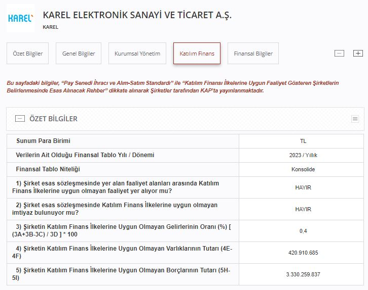

Karel Elektronik katılım endeksine uygun mu? KAREL hisse caiz mi, helal mi?

Karel Elektronik, 1986 yılında Türkiye’de telekomünikasyon ve elektronik alanında faaliyet göstermek üzere kurulmuş, sektörün öncü firmalarından biridir. Şirket, geniş ürün yelpazesiyle haberleşme, savunma sanayi ve elektronik çözümler sunarak, yerli üretime dayalı inovasyonlar geliştirmektedir. Karel, özellikle telefon santralleri, güvenlik sistemleri ve savunma teknolojileri alanında önemli başarılara imza atmıştır. 

Karel Elektronik (KAREL), 13.10.2006 tarihinde halka arz edilerek Borsa İstanbul'da işlem görmeye başlamıştır. Şirket, helal yatırım hassasiyeti olanlar için katılım endeksi konusunda araştırılmaktadır. KAREL hisseleri Borsa İstanbul'un BIST 500, BIST Ankara, BIST Tüm, BIST Tüm-100, BIST Bilişim, BIST Katılım Tüm, BIST Yıldız ve BIST Teknoloji endekslerine dahildir.

### **KAREL KATILIM ENDEKSİ**

Karel Elektronik (KAREL), Borsa İstanbul'un son açıklamasına göre katılım finans ilkelerini karşılamaktadır ve BIST Katılım Endeksine uygundur. KAREL'in helal yatırım arayışında olanlar için caiz olduğu değerlendirilmektedir.

