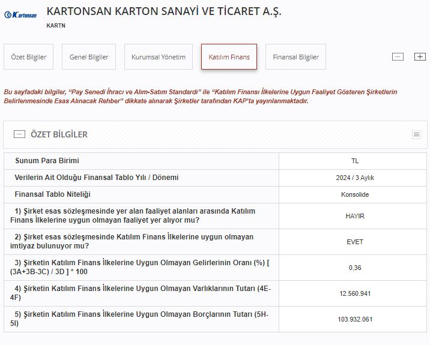

Kartonsan Karton Sanayi (KARTN) katılım endeksine uygun mu? KARTN hisse caiz mi, helal mi?

Kartonsan, 1967 yılında kurulan ve Türkiye'nin önde gelen kâğıt üreticilerinden biri olan bir şirkettir. Özellikle geri dönüştürülmüş kağıttan üretilen kuşe karton ve diğer karton ürünlerinde uzmanlaşan Kartonsan, çevre dostu ve sürdürülebilir üretim süreçleri ile dikkat çekmektedir. Şirket, iç pazarın yanı sıra uluslararası pazarlara da ihracat yaparak büyümesini sürdürmektedir.

Kartonsan (KARTN), 10.01.1986 tarihinde halka arz edilerek Borsa İstanbul'da işlem görmeye başlamıştır. Şirket, helal yatırım arayışında olanlar için katılım endeksi konusunda araştırılmaktadır.

## **KARTN KATILIM ENDEKSİ**

Kartonsan (KARTN), Borsa İstanbul'un son açıklamasına göre katılım endeksine uygun olmayan bir şirkettir. KARTN hisselerinin katılım finans ilkelerini karşılamadığından dolayı caiz olmayabileceği değerlendirilmektedir.

Kartonsan Borsa İstanbul'da BIST Yıldız, BIST Sınai, BIST Tüm, BIST 500, BIST Kocaeli, BIST Orman, Kağıt, Basım ve BIST Tüm-100 endekslerine dahildir. Katılım endeksi bu listede yoktur.

