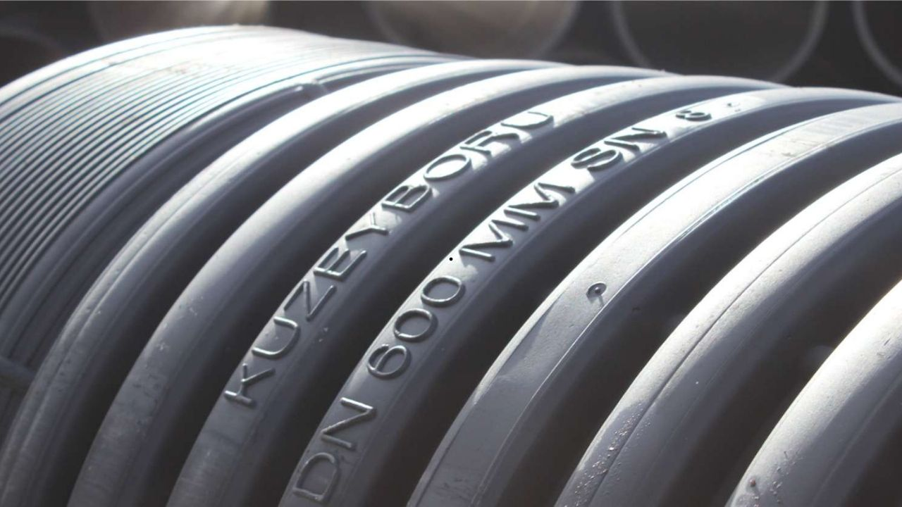

Borsa İstanbul şirketlerinden Kuzey Boru (KBORU), katıldığı bir ihaleyi kazanarak sözleşme imzaladı.

Halka arz edilmesinin ardından hisselerinin yükselişi ile adından söz ettiren Kuzey Boru, iş anlaşması haberleri ile de dikkat çekmeye devam ediyor. Şirket, Devlet Su İşleri Genel Müdürlüğü tarafından düzenlenen ihalenin sonuçlarını geçtiğimiz günlerde açıklamıştı. Söz konusu ihalede birinci geldiğini duyuran Kuzey Boru, bu kez de aynı ihale için sözleşme imzalandığını belirtti.

Kuzey Boru'dan yapılan KAP açıklamasında, ***"15.08.2024 tarihinde Kamu Aydınlatma Platformu'nda (KAP) yapmış olduğumuz bildirimde şirketimizin, Devlet Su İşleri Genel Müdürlüğü- 25. Bölge Müdürlüğü (Balıkesir) tarafından gerçekleştirilen 2024/900034 ihale kayıt numaralı "Çanakkale-Bayramiç Karaköy Göleti Sulaması Boru Alımı" konulu ihaleye katıldığı ve en avantajlı fiyatı vererek ihalede 1. olduğu bildirilmişti.***

***Devlet Su İşleri Genel Müdürlüğü- 25. Bölge Müdürlüğü İhale Komisyonu, şirketimize işin uhdemizde kaldığına dair kesinleşme kararını ve sözleşme davetini iletmiştir. Taraflar arasında sözleşme 11.09.2024 tarihinde imzalanmıştır.*** 

***İşin baz bedeli 12.857.112,83 TL (KDV Dahil) olup sözleşme bedelinin, 2024 yıl sonu itibarıyla şirket mali verilerine yansıması beklenmektedir.***

***Kamuoyu ve yatırımcılarımızın bilgilerine sunarız.***

***Saygılarımızla"*** ifadeleri yer aldı.