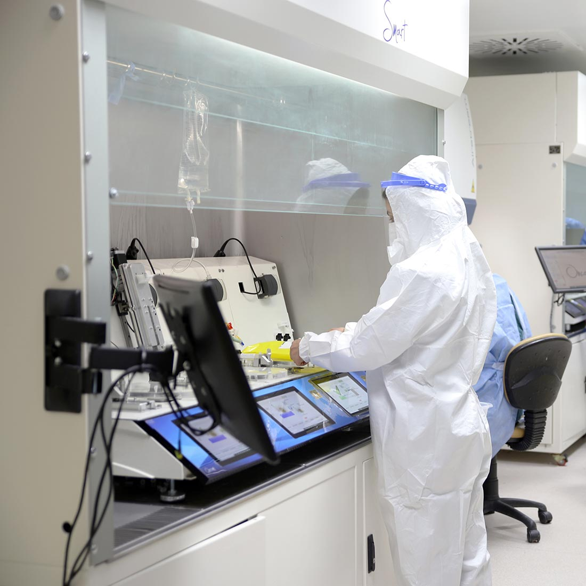
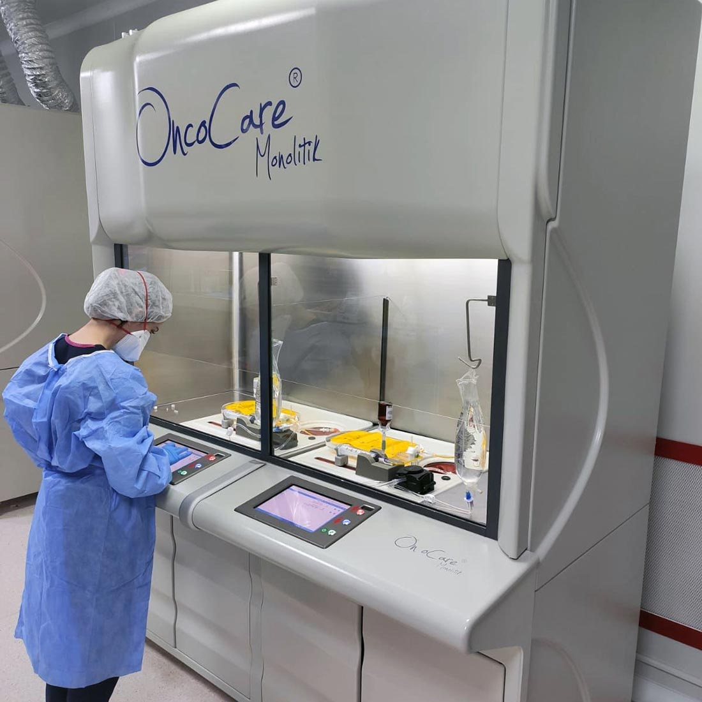

Sermaye Piyasası Kurulu’na halka arz için başvuran şirketlerden biri de Oncosem Onkolojik Sistemler San. ve Tic. A.Ş. oldu. Halka arz için onay bekleyen şirket hakkında detayları ve taslak izahnamede yer alan finansal tabloyu sizler için inceledik. 

Oncosem Onkolojik Sistemler’in halka arz onayı, yatırımcılar tarafından büyük merakla bekleniyor. Şirket hakkında derin araştırmaların yapılması üzerine, biz de şirketin ne iş yaptığına cevap aradık ve halka arz detaylarına dair incelemelerde bulunduk.

## **ONCOSEM ONKOLOJİK SİSTEMLER NE İŞ YAPAR?**

Oncosem, Ankara’da kurulan ve 2008 yılında faaliyete geçen bir firmadır. Şirket, kanser tedavisinde kullanılan ekipmanlar ve tıbbi cihazlar üretmektedir. 

Öte yandan Diagnostik testler ve Koruyucu ekipmanlar üretimi ile de adından söz ettiren şirketlerden biridir. Yaklaşık 15 yıllık tecrübeye sahip olan şirket, yıllık 3 milyon Kemoterapi Set Üretimine ve alanında deneyimli 300’ün üzerinde çalışana sahiptir.

### **ONCOSEM HALKA ARZ DETAYLARI**

SPK onayı yatırımcılar tarafından büyük merakla beklenen Oncosem Onkolojik Sistemler’in halka arzına İnfo Yatırım liderlik edecek. Şirket, halka arza toplam **5.950.000 TL** nominal değerli payı konu edecek. Taslak izahnamede yer alan bilgilere göre dağıtım yöntemi ise **bireysel yatırımcılara eşit dağıtım** şeklinde olacak. Halka arzda hisse fiyatı ise **17,50 TL** olarak duyuruldu.

*Şirketin halka arzına dair; tahsisat oranları ise şu şekilde:*

* 2.380.000 TL nominal değerdeki (%40) kısmı Yurt İçi Bireysel Yatırımcılar'a
* 2.380.000 TL nominal değerdeki (%40) kısmı Yurt İçi Kurumsal Yatırımcılar'a
* 1.190.000 TL nominal değerdeki (%20) kısmı Yurt Dışı Kurumsal Yatırımcılara'a

Oncosem Onkolojik Sistemler’in halka arzdaki işlem kodunun ise **ONCSM.**
Şirketin taslak izahnamesinde yer alan finansal tabloyu sizler için derledik. Aşağıda yer alan videodan izleyebilirsiniz.

<iframe width="677" height="381" src="https://www.youtube.com/embed/SdX6w3ctZBk" title="Oncosem Onkolojik Sistemler halka arz taslak izahname inceleme" frameborder="0" allow="accelerometer; autoplay; clipboard-write; encrypted-media; gyroscope; picture-in-picture" allowfullscreen></iframe>

#### **ONCOSEM NEDEN HALKA ARZ KARARI ALDI?**

Şirketin izahnamesinde yer alan bilgilerde, halka arz gerekçeleri şu şekilde sıralandı:

* Şirketin özkaynaklarının güçlendirilmesi, Makine ve ekipman yatırımı,
* Büyüme hedeflerinin devamlılığının sağlanması,
* Sürdürülebilir kurumsal yapının oluşturulması ve raporlama standartlarının geliştirilmesi,
* Şeffaflık ve hesap verilebilirlik düzeyinin yükseltilmesi,
* Şirketin bilinirliğinin yurt içinde ve yurt dışında artırılması,
* Rekabet gücünün artırılması,
* Şirket paylarının likit hale getirilmesi neticesinde kredi verenler nezdinde gerekmesi durumunda daha düşük maliyetle borçlanma imkanına kavuşulması,
* Potansiyel müşteriler, yatırımcılar ve iş ortakları nezdinde mevcut güvenilirliğin ve saygınlığın artırılması,
* Payların borsada işlem görmesi ile piyasa değerinin güncel olarak tutulması,
* Halka arz ile yatırımcı nezdinde olumlu bir algı elde ettikten sonra finansman amaçlı kullanılabilecek diğer sermaye piyasaları enstrümanlarının ihracı (tahvil vb.) olarak sayılabilir.

##### **ONCOSEM HALKA ARZ GELİRİNİ NEREDE KULLANACAK?**

Halka arz eden ortak Erol Çelik'in 2.000.000 adet payın satışından elde edeceği toplamda 35.000.000 TL gelirden 1.677.783 TL olan halka arz maliyetinin çıkarılması ile 33.322.217 TL tutarında net gelir elde etmesi beklenmekte olup, söz konusu gelir Erol Çelik'in tasarrufunda olacaktır.

Şirket, özkaynaklarını güçlendirmek amacıyla yapılacak sermaye artırımı kapsamında elde edilecek kaynağın;

* %13'üne karşılık gelen 8.414.250 TL'nin Almanya, İngiltere ve diğer yurt dışı pazarlarda planlanan yüksek teknoloji cihazlar, teknoloji transferi, temiz oda, atık sistemleri vb. yatırımların finanse edilmesinde kullanılmasına,
* %36'sına karşılık gelen 23.301.000 TL'nin planlanan üretim fabrikası yatırımı kapsamında kullanılmasına,
* %28'ine karşılık gelen 18.123.000 TL'nin üretim kapasitesinin artırılmasına yönelik yapılacak makine ve ekipman yatırımları kapsamında kullanılmasına, 
* %23'üne karşılık gelen 14.886.750 TL'nin işletme sermayesi ihtiyacının finanse edilmesinde kullanılmasına karar vermiştir.

> Oncesem’in halka arz detaylarını kaçırmamak için **Google Play**’de yer alan **HALKA ARZ** uygulamamızı **[BURADAN ](https://play.google.com/store/apps/details?id=com.halkaarzhaber.hisseler&hl=en&gl=TR)**indirebilirsiniz.
>
> ***Bu sayfada yer alan haberler ve haberlerin içerdiği şirketler hakkındaki bilgiler yatırım danışmanlığı kapsamında değildir.***