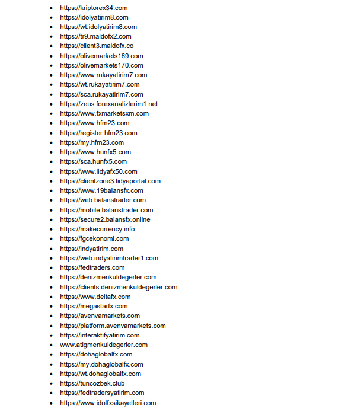

Sermaye Piyasası Kurulu, 21 Mart tarihinde SPK Bülteni yayımlandı. Yayımlanan bültende alınan kararları kamuoyu ile paylaşan Kurul, 42 web sitesinin de kapatılmasına karar verildiğini açıkladı.

SPK Bülteni’nde öne çıkan başlıklar arasındaki dikkat çekenlerden biri de **KTSKR**, **JANTS** ve **GOLTS** hisselerinde gerçekleştirilen işlemler ve sosyal medya platformlarında yapılan paylaşımlar nedeniyle bir kişiye idari para cezası verildiği oldu.

Öte yandan Kurul, **42 web sitesinin de kapatılmasına karar verildiğini** açıkladı. SPK’dan konuya ilişkin yapılan açıklamada ise şu ifadelere yer verildi:

***“Türkiye’de yerleşik kişilere yönelik olarak internet aracılığıyla yurtdışında kaldıraçlı işlem yaptırıldığı belirlenen ve aşağıda adresleri verilen internet sitelerine erişimin engellenmesi için Sermaye Piyasası Kanunu’nun 99’uncu maddesinin dördüncü fıkrası uyarınca gerekli hukuki işlemlerin yapılmasına karar verilmiştir.”***

**KAPATILMASINA KARAR VERİLEN WEB SİTELERİ İSE ŞU ŞEKİLDE SIRALANDI!**

