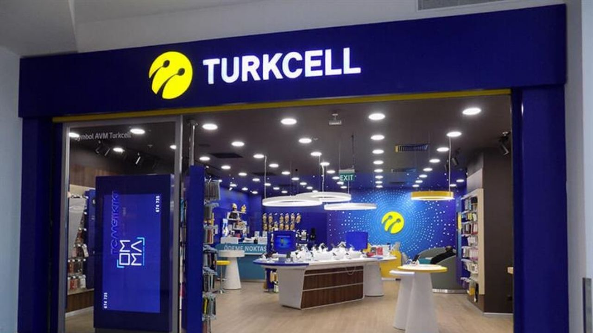

Borsa İstanbul şirketlerinden Turkcell İletişim Hizmetleri A.Ş. (TCELL), geçtiğimiz gün 2024 yılının 2. çeyrek bilançosunu açıkladı. Şirketin bilanço açıklamasının ardından TCELL hissesi için 8 kurumdan hedef fiyat açıklaması geldi.

Turkcell İletişim Hizmetleri A.Ş. (TCELL), 2024 yılının ilk 6 aylık döneminde 5,76 milyar TL net kâr açıkladı. Şirket, geçen yılın aynı döneminde ise 1,11 milyar TL zarar duyurmuştu. Turkcell'in bilançosu zarardan kâra geçti. Gelen bu haberin ardından 8 farklı kurum, TCELL hisseleri için hazırlanan raporu yayınladı.

    <table class="table table-striped">
        <thead>
            <tr>
                <th colspan="4" scope="col">
                    <h2>TCELL HEDEF FİYAT</h2>
                </th>
            </tr>
        </thead>
        <tbody>
            <tr>
                <th scope="row">KURUM</th>
                <td><strong>HEDEF FİYAT</strong></td>
                <td><strong>POTANSİYEL GETİRİ</strong></td>
                <td><strong>TAVSİYE</strong></td>
            </tr>
            <tr>
                <th scope="row">İntegral Yatırım</th>
                <td>137 TL</td>
                <td>%45</td>
                <td>Nötr</td>
            </tr>
            <tr>
                <th scope="row">Garanti BBVA Yatırım</th>
                <td>137 TL</td>
                <td>%45</td>
                <td>Endeks Ü. Getiri</td>
            </tr>
            <tr>
                <th scope="row">Gedik Yatırım</th>
                <td>146,95 TL</td>
                <td>%55</td>
                <td>Endeks Ü. Getiri</td>
            </tr>
            <tr>
                <th scope="row">Oyak Yatırım</th>
                <td>135 TL</td>
                <td>%43</td>
                <td>Endeks Ü. Getiri</td>
            </tr>
            <tr>
                <th scope="row">Ak Yatırım</th>
                <td>150 TL</td>
                <td>%58</td>
                <td>Endeks Ü. Getiri</td>
            </tr>
            <tr>
                <th scope="row">Halk Yatırım</th>
                <td>125,85 TL</td>
                <td>%33</td>
                <td>TUT</td>
            </tr>
            <tr>
                <th scope="row">Deniz Yatırım</th>
                <td>148,80 TL</td>
                <td>%57</td>
                <td>AL</td>
            </tr>
            <tr>
                <th scope="row">Vakıf Yatırım</th>
                <td>143 TL</td>
                <td>%51</td>
                <td>AL</td>
            </tr>
        </tbody>
    </table>

<a href="https://whatsapp.com/channel/0029VaA04UY8V0ttAemtV435" rel="noopener" target="_blank" title="WhatsApp Kanalı"><strong>Whatsapp Kanalımıza Katılın. Gelişmeleri ka&ccedil;ırmayın!</strong></a>

YASAL UYARI: Burada yer alan yatırım bilgi, yorum ve tavsiyeleri yatırım danışmanlığı kapsamında değildir. Yatırım danışmanlığı hizmeti, aracı kurumlar, portf&ouml;y y&ouml;netim şirketleri, mevduat kabul etmeyen bankalar ile m&uuml;şteri arasında imzalanacak yatırım danışmanlığı s&ouml;zleşmesi &ccedil;er&ccedil;evesinde sunulmaktadır.&nbsp;
