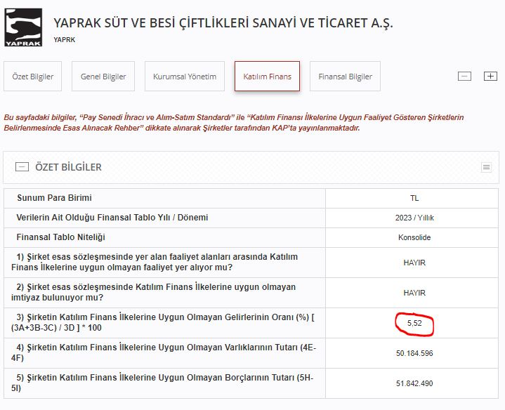

Yaprak Süt ve Besicilik, 1994 yılında süt ve süt ürünleri üretimine başlamış, Türkiye'nin önemli süt üreticilerinden biridir. Modern tesislerinde sağlıklı, doğal ve kaliteli süt ürünleri üreten şirket, hayvancılık ve besicilik faaliyetleriyle de tanınmaktadır. Gıda güvenliği standartlarına uygun üretim yaparak, yerel pazarda ve ihracat pazarında geniş bir müşteri kitlesine hizmet vermektedir. Yaprak Süt, sektörde güvenilirliği ve sürdürülebilirlik anlayışı ile öne çıkmakta, sürekli gelişen teknolojilerle üretim kapasitesini artırmaktadır.

## **YAPRK KATILIM ENDEKSİ**

Yaprak Süt (YAPRK), Borsa İstanbul'un son açıklamasına göre katılım endeksine uygun değildir. YAPRK hisselerinin helal yatırım arayışında olanlar için caiz olmayabileceği değerlenedirilmektedir.

### **YAPRK NEDEN KATILIM ENDEKSİNE UYGUN DEĞİL?**

Yaprak Süt'ün 2023 yılı finansal tablosunda, katılım finans ilkelerine uygun olmayan gelir oranı %5'in üzerinde olduğundan YAPRK katılımda yoktur. 

Borsa İstanbul'da işlem gören şirketlerin katılım endeksi durumu periyodik olarak değişmektedir. Yaprak Süt de sonraki güncellemelerde katılım endeksine dahil olabilir.