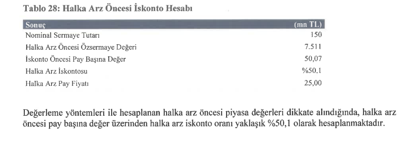

Sermaye Piyasası Kurulu, 1 Haziran 2023 tarihinde 4 şirketin halka arzına onay verdi. Onay alan şirketlerden Pasifik Eurasia Lojistik’in halka arz iskontosu görenleri şaşırttı. Şirketin yayınlanan fiyat tespit raporunda, iskonto oranının %50,1 olduğu görüldü.

Halk Yatırım Menkul Değerler A.Ş. liderliğinde halka arz edilecek olan şirket, toplam **34 milyon** lotu halka arza konu edecek. Şirketin halka arzında fiyat ise **25 TL** olarak açıklandı. Halka arz büyüklüğü **850 milyon TL** olan Pasifik Eurasia Lojistik’in işlem kodu ise **PASEU** olacak.

> **HATIRLATMA:** Halka arz, sermaye artırımı ve borsa haberleri için mobil uygulamalarımızdan cihazınıza uygun olanı indirmeyi unutmayın. **iOS** ve **Android** uygulama linkleri, sayfanın en altında yer almaktadır.

**%50’LİK İSKONTO**

**Pasifik Eurasia Lojistik**’in fiyat tespit raporu **Halk Yatırım Menkul Değerler A.Ş.** tarafından yayınlandı. Yayınlanan raporda şirket hisselerinin **iskonto** öncesi pay başına değerinin **50,07 TL** olduğu belirtildi. **Halka arz fiyatı 25 TL** olan şirketin iskonto oranı ise **%50,1** olarak duyuruldu.

**[PASİFİK EURASIA HALKA ARZINA DAİR TÜM DETAYLAR İÇİN TIKLAYIN](https://www.halkaarzhisseler.com/pasifik-eurasia-halka-arz-ne-zaman-kac-lot-verir-borsada-ne-zaman-islem-gorecek/)**