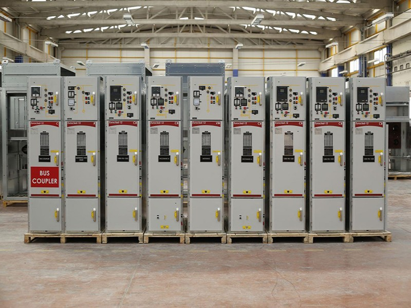
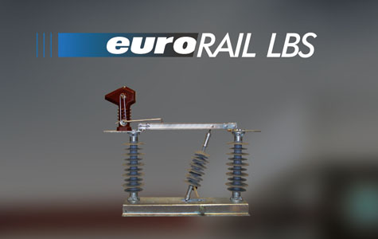

Halka arz hazırlıklarını sürdüren şirketlerden **Europower Enerji ve Otomasyon Teknolojileri A.Ş.**, SPK’ya gerekli başvuruyu yaptı. Gelin hep birlikte şirket hakkında kısaca bilgi edindikten sonra **halka arz** için yayınlanan taslak izahnameyi birlikte inceleyelim.

SPK’dan halka arz için onay bekleyen **Europower Enerji**, son zamanlarda yatırımcıların da dikkatlerini çeken bir şirket. Halka arz başvurusunun gelmesinin ardından şirket hakkında birçok detay da internet üzerinde araştırılıyor. Özellikle Avrupa’da baş gösteren '***enerji krizi'*** ile birlikte **Borsa İstanbul**’da da enerji şirketlerine yatırımcıların ilgisi artmıştı.

Böyle bir atmosferde **Europower Enerji**’nin de halka arz başvurusu yapması üzerine dikkatler şirketin üzerine çevrildi. Peki, halka arz hazırlıklarını sürdüren Europower Enerji ne iş yapar, halka arzda kaç lot satılacak, hisse fiyatı nedir, dağıtım yöntemi nasıl olacak? Gelin hep birlikte şirket hakkında detaylara bakalım.

### **EUROPOWER ENERJİ NE İŞ YAPAR?**

Halka arz hazırlıklarına devam eden Europower Enerji; son zamanlarda borsadaki yükselişi ile dikkatleri üzerine çeken ve yatırımcılarını mutlu eden **Girişim Elektrik**’in iştiraklerinden biridir. **GESAN** işlem kodu ile borsada işlem gören Girişim Elektrik, Europower Enerji’nin **%70**’ine ortaktır. 

**Merkezi Ankara’da bulunan Europower’ın faaliyet alanı ve üretimi ise şu şekilde:**

* Metal sac, sandviç panel, beton ve özel tip kompakt trafo merkezleri / kiosklar, 
* Çeşitli mobil trafo merkezleri, 
* Raylı sistemler için havai hat vakumlu yük ayırıcılar, havai hat ayırıcıları,
* YG-OG-AG kapasitör bankları, sabit ve mobil güç faktörü düzeltme sistemleri.

Şirket, özellikle trafo sistemleri ve raylı sistem hatlarındaki faaliyetleri ile dikkat çekmiştir.

#### **EUROPOWER ENERJİ HALKA ARZ DETAYLARI**

Şirket, halka arza toplam **60.000.000 TL** nominal değerli payı konu edecek. 

**Ak Yatırım**’ın konsorsiyum lideri olduğu halka arzda **hisse başı fiyat** henüz netleşmedi. 

Europower’ın taslak izahnamesinde yer alan bilgilere göre, dağıtım şekli ise **oransal** olacak. 

Tahsisat oranlarının da halka arz onayı gelmesinin ardından netleşmesi bekleniyor. 

Şirketin halka arzda işlem kodu ise **EUPWR** olacak.

Aşağıda yer alan videoda, Europower Enerji'nin taslak izahnamesinde yer alan finansal tabloyu sizler için hazırladık. Youtube kanalımıza abone olarak, hazırladığımız taslak ve onaylı izahnamelerden ilk siz haberdar olabilirsiniz.

<iframe width="853" height="480" src="https://www.youtube.com/embed/NFeBaePJypU" title="Europower Enerji halka arz taslak izahname inceleme #EUPWR" frameborder="0" allow="accelerometer; autoplay; clipboard-write; encrypted-media; gyroscope; picture-in-picture" allowfullscreen></iframe>

##### **HALKA ARZIN GEREKÇESİ**

Europower Enerji, taslak izahnamede halka arz gerekçesi olarak şu ifadelere yer verdi:

***“Halka arz ile sermaye artışı yoluyla kaynak elde edilmesi, kurumsallaşma, şirket değerinin ortaya çıkması, bilinirlik ve tanınırlığın pekiştirilmesi, şeffaflık ve hesap verilebilirlik ilkelerinin daha güçlü bir şekilde uygulanması, Şirket'in kurumsal kimliğini güçlendirmesi hedeflenmektedir.”***

###### **HALKA ARZ GELİRİ NEREDE KULLANILACAK?**

Konuyla ilgili şirketin taslak izahnamesinde yer alan bilgilere göre halka arz geliri şu şekilde kullanılacak:

* Ar-ge ve Ür-ge çalışmaları ve bu çalışmalar sonucu çıkan ürünlerin seri imalata dönüşümü, planlanan ve muhtemel yeni yatırımların gerçekleştirilmesi: **%25-%35**
* Devam eden yatırımların sonuçlandırılması-Üretim kapasitesinin ve çeşitliliğin artırılması- Gayrimenkul, iş makinesi, makine, teçhizat, ekipman, taşıt alım ve yenilemeleri: **%25-%35**
* Finansman ve kısa vadeli borç ödemelerinde kullanılması: **%10-%20**
* İşletme sermayesi olarak değerlendirilmesi (hammadde ve yarı mamul alımı, faaliyet giderleri ve benzeri giderler dahil): **%25-%40**

Europower Enerji’nin halka arz onayı almasının ardından birçok detay da netlik kazanacaktır. 

Bu detayları kaçırmamak için **Google Play**’de yer alan **HALKA ARZ** uygulamamızı **[BURADAN ](https://play.google.com/store/apps/details?id=com.halkaarzhaber.hisseler&hl=en&gl=TR)**indirebilirsiniz.

***Bu sayfada yer alan haberler ve haberlerin içerdiği şirketler hakkındaki bilgiler yatırım danışmanlığı kapsamında değildir.***