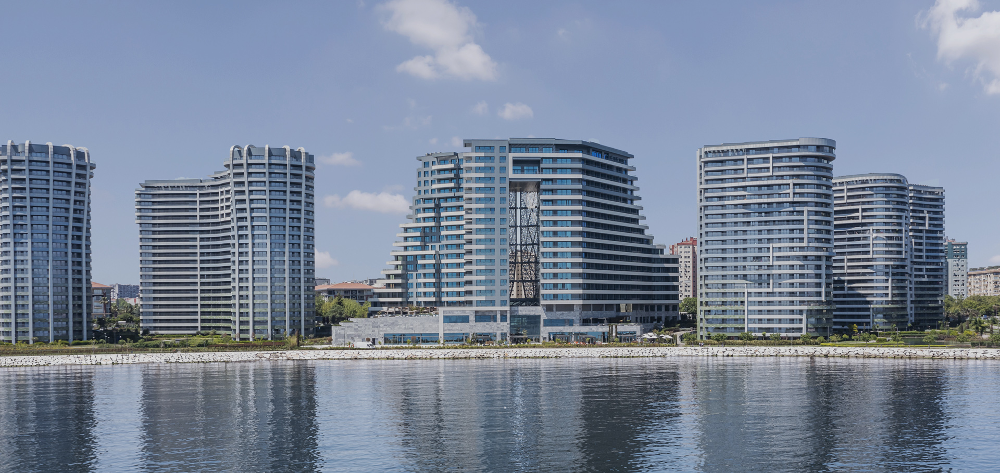

Halka arz kervanına bir şirket daha katıldı. Kuzu Grup Gayrimenkul Yatırım Ortaklığı A.Ş., halka arz için taslak izahnamesini yayımladı. Kuzu Grup GYO halka arz tarihi talep toplama ne zaman, borsada ne zaman işleme başlayacak? Kuzu Grup GYO kaç lot verir, hangi bankalar, T1 ve T2 bakiye geçerli mi? Kuzugrup GYO halka arz katılım endeksine uygun mu?

**Kuzu Grup GYO**'nun izahnamesinde öne çıkan detaylar şu şekilde:

- - -

**SPK Onay Tarihi:** 16 Ağustos 2023

**Talep Toplama Tarihleri:** 21-22-23 Ağustos 2023

**Sermaye Artırımı:** 25.000.000

**Ortak Satışı:** 25.000.000

**Toplam Pay Adedi:** 50.000.000

**Hisse Fiyatı:** 20,76 TL

**Halka Arz İskontosu:** %20

**Halka Açıklık Oranı:** %25

**Arz Sonrası PD/DD:** 0,63

**Arz Sonrası F/K:** 2,21

**Halka Arz Büyüklüğü:** 1.038.000.000 TL

**Dağıtım Yöntemi:** Bireysel Yatırımcılara Eşit Dağıtım

**Hisse Kodu:** KZGYO

**İşlem Tarihi:** 29 Ağustos 2023 Salı

***T1 ve T2 bakiye kullanılamaz.***

***`KATILIM ENDEKSİNE UYGUN DEĞİL`***

- - -

**TAHSİSAT ORANLARI**

**Bireysel Yatırımcı:** 27.500.000 lot (%55)

**Kurumsal Yatırımcı:** 10.000.000 (%20)

**Y.Dışı Kurumsal Yatırımcı:** 12.500.000 (%25)

- - -

**FON KULLANIM YERLERİ**

**Finansman Ödemesi:** %65-75

**Rezidansların tefrişi yatırımı:** %20-25

**İşletme sermayesi:** %5-10

- - -

**ÖNEMLİ DETAYLAR**

**30 gün fiyat istikrarı** planlanmaktadır.

Şirket, **12 ay boyunca** bedelli/bedelsiz sermaye artırımı gerçekleştirmeyeceğini ve aynı süre boyunca pay satışı yapmayacağını taahhüt etmektedir.

Ortaklar **1 yıl boyuna** pay satışı gerçekleştirmeyeceğini taahhüt etmektedir.

- - -

**KAÇ LOT VERİR?**

**1 milyon katılım:** 28 lot (582 TL)

**1,2 milyon katılım:** 23 lot (478 TL)

**1,4 milyon katılım:** 20 lot (416 TL)

**1,6 milyon katılım:** 17 lot (353 TL)

**1,8 milyon katılım:** 15 lot (312 TL)

**2 milyon katılım:** 13 lot (270 TL)

- - -

> **TÜM DETAYLARI SAYFANIN EN ALTINDA LİNKLERİ BULUNAN MOBİL UYGULAMALARIMIZ ÜZERİNDEN ANLIK BİLDİRİMLERLE TAKİP EDEBİLİRSİNİZ.**

- - -

**KUZU GRUP GYO NE İŞ YAPAR?**

**1943** yılında kurulan ve **80 yıldır** istikrarlı yükselişini sürdüren **Kuzu Grup** tarafından hayat geçirilen **Kuzu Grup Gayri Menkul Yatırım Ortaklığı Anonim Şirketi (Kuzu Grup GYO A.Ş.)**, gayrimenkul geliştirme ve turizm yatırımlarında lider oyuncu olma vizyonuyla hareket etmektedir.

Tüm projelerinde sürdürülebilirlik anlayışı ile hareket eden **Kuzu Grup**, sektöründe kalite ve güvenin temsilcisi haline gelirken, insanlığın refahı ve daha yaşanabilir bir dünya için yatırımlarına devam etmektedir.

**Kuzu Grup Gayrimenkul Geliştirme A.Ş.** 15.06.2021 tarihinde kurulmuş ve 03.05.2023 tarihinde “Kuzu Grup Gayrimenkul Yatırım Ortaklığı A.Ş.” (**Kuzu Grup GYO A.Ş.**) unvanını alarak gayrimenkul yatırım ortaklığına dönüşmüştür.

Şirket; gayrimenkuller, gayrimenkul projeleri, gayrimenkule dayalı haklar, sermaye piyasası araçları ve Sermaye Piyasası Kurulunca belirlenecek diğer varlık ve haklardan oluşan portföyü işletmek amacıyla paylarını ihraç etmek üzere kurulan ve sermaye piyasası mevzuatında izin verilen diğer faaliyetlerde bulunabilen sermaye piyasası kurumu niteliğinde kayıtlı sermayeli **halka açık anonim ortaklıktır.**

Kuzu Grup GYO A.Ş, dünyanın başlıca otel zincirlerinden Bonvoy ile 2021’de yaptığı işletme anlaşması yaparak İstanbul Ataköy sahilde faaliyete geçen JW Marriott Hotel İstanbul Marmara Sea ile uzun vadeli kira sözleşmeleri imzalayarak düzenli ve öngörülebilir kira geliri elde etmektedir.

JW Marriott Hotel İstanbul Marmara Sea, 204 otel odası ve 62 uzun dönem konaklama yapılabilecek rezidans dairesi ile Ataköy’de, sahil erişimi ve eşsiz Marmara denizi manzarası ile misafirlerine hem şehir oteli konforu hem de deniz kenarının benzersiz konaklama tecrübesi sunmaktadır.

**Kaynak: Şirket web sitesi**

**BANKA VE ARACI KURUMLAR**

Tera Yatırım Menkul Değerler A.Ş.

A1 Capital Yatırım Menkul Değerler A.Ş.

Acar Yatırım Menkul Değerler A.Ş.

Ahlatcı Yatırım Menkul Değerler A.Ş.

ALB Yatırım Menkul Değerler A.Ş.

Alnus Yatırım Menkul Değerler A.Ş.

Alternatif Yatırım Menkul Kıymetler A.Ş.

Anadolu Yatırım Menkul Değerler A.Ş.

Ata Yatırım Menkul Kıymetler A.Ş.

Aktif Yatırım Bankası

Bizim Menkul Değerler A.Ş.

Burgan Menkul Değerler A.Ş.

Deniz Yatırım Menkul Kıymetler A.Ş.

Denizbank

Dinamik Menkul Değerler A.Ş.

Garanti Yatırım Menkul Kıymetler A.Ş.

Garanti Bankası

Gedik Yatırım Menkul Değerler A.Ş.

Global Menkul Değerler A.Ş.

Halk Yatırım Menkul Değerler A.Ş.

Türkiye Halk Bankası

ING Yatırım Menkul Değerler A.Ş.

ING Bank

İnfo Yatırım Menkul Değerler A.Ş.

İntegral Yatırım Menkul Değerler A.Ş.

Invest Az Yatırım Menkul Değerler A.Ş.

İş Yatırım Menkul Değerler A.Ş.

Türkiye İş Bankası

Marbaş Menkul Değerler A.Ş.

Meksa Yatırım Menkul Değerler A.Ş.

Osmanlı Yatırım Menkul Değerler A.Ş.

Oyak Yatırım Menkul Değerler A.Ş.

Fibabanka

Phillip Capital Menkul Değerler A.Ş.

QNB Finans Yatırım Menkul Değerler A.Ş.

Sanko Yatırım Menkul Değerler A.Ş.

Şeker Yatırım Menkul Değerler A.Ş.

Şekerbank

Tacirler Yatırım Menkul Değerler A.Ş.

Odeabank

Trive Yatırım Menmul Değerler A.Ş.

Turkish Yatırım Menkul Değerler A.Ş.

Ünlü Yatırım Menkul Değerler A.Ş.

Vakıf Yatırım Menkul Değerler A.Ş.

Türkiye Vakıflar Bankası

Yatırım Finansman Menkul Değerler A.Ş.

Ziraat Yatırım Menkul Değerler A.Ş.

Ziraat Bankası

Prim Menkul Değerler A.Ş.

Pay Menkul Değerler A.Ş