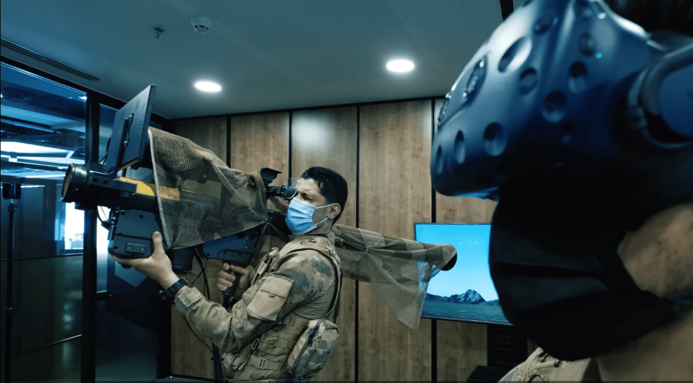

Türkiye son yıllarda **savunma sanayi** sektöründe adından söz ettirmeye başladı. Ülkemizde bu alanda birçok şirket kuruldu ve kurulmaya da devam ediyor. Bazı şirketler de büyümeye ve gelişemeye yönelik adımlar atarak sektörde varlığını devam ettirmeye ve yaptığı-yapacağı çalışmalarla adından söz ettirmeyi hedefliyor.

Bu şirketlerden biri de şüphesiz **SDT Uzay ve Savunma Teknolojileri A.Ş.** oldu. Şirket, sektörde rekabet gücünü artırmaya yönelik bir adım atarak halka arz kararı aldı. Bu karar doğrultusunda gerekli başvuruyu Sermaye Piyasası Kurulu’na ileten SDT hakkında kısaca bilgi verdikten sonra şirketin taslak izahnamesinde yer alan bilgileri birlikte inceleyeceğiz.

## **SDT UZAY VE SAVUNMA TEKNOLOJİLERİ NE İŞ YAPAR?**

ODTÜ Teknokent yerleşkesi içerisinde Ar-Ge’ ye dayalı alanlarda yerli ürünler ve yetenekler geliştiren bir savunma sanayi firması olarak faaliyet göstermektedir. 2005 yılında kurulan SDT, o tarihten bu yana çeşitli savunma elektroniği ve yazılım ürünlerini ortaya koymuş ve kullanıma sunmuştur.

SDT’nin uzmanlık alanları ise şu şekilde sıralanabilir: 

* Algılayıcı (Radar, Kızıl Ötesi vb) ve elektronik harp sinyal işleme ve analiz sistemlerini,
* Görüntü işleme ve analiz yazılımlarını,
* Uydu yer istasyonları, uydu sinyal/veri işleme ve analiz sistemlerini,
* Hava platformları ve silah sistemleri ile elektronik/aviyonik sistemlerini,
* Kara platformları elektronik ünitelerini,
* RF Karıştırıcı sistemler, mühimmat güdüm elektroniği ve simülasyon/bilişim sistemlerini özgün ve yerli olarak gerçekleştirmektedir.

### **SDT UZAY VE SAVUNMA TEKNOLOJİLERİ HALKA ARZ BİLGİLERİ**

Halka arz hazırlıklarına devam eden SDT Uzay ve Savunma Teknolojileri A.Ş., halka arz işlemine toplam **12.250.000 TL** nominal değerli payı konu edecek. İnfo Yatırım’ın liderlik edeceği halka arzda dağıtım şekli ise **bireysel yatırımcılara eşit dağıtım** olacak. Yurtiçi ve yurtdışı kurumsal yatırımcılar ise oransal dağıtım yöntemine tabi tutulacak.

Şirketin halka arzında tahsisat oranları ve **hisse başı** fiyat ise **32 TL** olarak duyuruldu. SDT’nin, halka arzda kullanacağı işlem kodu ise **SDTTR**. 2 iş günü boyunca banka ve aracı kurumlar üzerinden talep toplayacak olan SDT’nin bu tarihi de açıkladı. SDT, **28-29 Aralık** tarihlerinde talep toplayacak.

Şirketin taslak izahnamesinde yer alan finansal tabloyu sizler için inceledik. Aşağıdaki video üzerinden izleyebilirsiniz. 

<iframe width="640" height="360" src="https://www.youtube.com/embed/5JeR8u_Yfso" title="SDT Uzay ve Savunma Teknolojileri taslak izahname inceleme" frameborder="0" allow="accelerometer; autoplay; clipboard-write; encrypted-media; gyroscope; picture-in-picture" allowfullscreen></iframe>

#### **SDT’NİN HALKA ARZ GEREKÇESİ**

*SDT Uzay ve Savunma Teknolojileri A.Ş.'nin taslak izahnamesinde yer alan bilgilere göre; halka arz gerekçeleri şu şekilde sıralandı:*

* Şirket'in özkaynaklarının güçlendirilmesi
* Ankara Uzay ve Havacılık İhtisas Organize Sanayii Bölgesinde yeni yerleşke binasının yapılması ve üretim kapasitesinin artırılmasına yönelik yatırımların gerçekleştirilmesi
* Mevcut ve olası projelerin geliştirilmesi ve işletme sermayesi ihtiyacının karşılanması
* Büyüme hedeflerinin devamlılığının sağlanması ve büyüme hedeflerine bağlı olarak araştırma ve geliştirme faaliyetlerinin devam ettirilmesi
* Şirket'in bilinirliğinin yurt içi ve yurt dışında artırılması
* Rekabet gücünün artırılması
* Potansiyel müşteriler nezdinde mevcut güvenilirliğin ve saygınlığın artırılması
* Sürdürülebilir kurumsal yapının oluşturulması ve raporlama standartlarının geliştirilmesi
* Şeffaflık ve hesap verilebilirlik düzeyinin yükseltilmesi
* Şirket paylarının likit hale getirilmesi neticesinde kredi verenler nezdinde gerekmesi durumunda daha düşük maliyetle borçlanma imkanına kavuşulması olarak sayılabilir.

SDT Uzay ve Savunma Teknolojileri’nin halka arz detayları belli oldu. Bu detayları kaçırmamak için **Google Play**’de yer alan **HALKA ARZ** uygulamamızı **[BURAYA](https://play.google.com/store/apps/details?id=com.halkaarzhaber.hisseler&hl=en&gl=TR)** indirebilirsiniz.

***Bu sayfada yer alan haberler ve haberlerin içerdiği şirketler hakkındaki bilgiler yatırım danışmanlığı kapsamında değildir.***