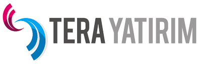

Tera Yatırım Menkul Değerler A.Ş., Sermaye Piyasası Kurulu’ndan 9 Aralık tarihinde halka arz için onay aldı. Şirket, geçtiğimiz gün Kamuoyu Aydınlatma Platformu üzerinden halka arza dair detayları yatırımcılarla paylaştı. TERA’nın halka arzına dair tüm detayları haberimizde bulabilirsiniz.

## **TERA YATIRIM NE İŞ YAPAR?**

1990 yılında kurulan ve eski unvanı Stok Menkul Değerler A.Ş. olan kurum, 2005 yılından beri yeni ortaklık yapısı altında, Tera Yatırım ismi, yenilenen uzman kadrosu ve güçlü özsermaye yapısı ile yoluna devam etmektedir. 

Tera Yatırım, Türkiye'nin yatırım bankacılığı ve aracılık faaliyetleri konusunda önde gelen kurumlarından biri olup yerli ve yabancı müşterilere kurumsal finansman, aracılık ve araştırma hizmetleri sunmaktadır. 

Ayrıca portföy yönetimi alanında faaliyet gösteren Tera Portföy Yönetimi A.Ş’nin tamamının sahibidir. Müşteri ve çözüm odaklı kurum kültürünü tecrübesi ile birleştiren Tera Yatırım, Türkiye'de aracı kurumlar arasında öne çıkmayı, yenilikçi ve kaliteli hizmet sağlamayı ilke edinmiştir.

### **TERA YATIRIM HALKA ARZ DETAYLARI**

Şirket, halka arza **15.000.000 TL** nominal değerli payı bedelli sermaye artırımı şeklinde, **1.500.000 TL** nominal değerli payı da ek satış şeklinde halka arza konu edecek. Yani halka arzda **toplam** **16.500.000 TL** nominal değerli pay satılacak.

Halka arz fiyatı ise **10 TL** olarak duyuruldu. Tera Yatırım’ın halka arzında dağıtım şekli ise **oransal dağıtım** olacak. 

Halka arza dair talep toplama tarihlerini de açıklayan şirket, **15-16 Aralık** tarihlerinde 2 iş günü boyunca daha önceden belirenmiş **banka ve aracı kurumlar** üzerinden halka arza katılım sağlanabileceğini duyurdu. 

***Bu banka ve aracı kurumları aşağıda bulabilirsiniz.***

Tera Yatırım’ın Borsa İstanbul’da işlem göreceği kod ise **TERA** olacak.

Şirketin taslak izahnamesinde yer alan finansal tabloyu, aşağıda yer alan videoda sizler için inceledik. YouTube kanalımıza abone olarak halka arza dair gelişmelerden anında haberdar olabilirsiniz.

<iframe width="640" height="360" src="https://www.youtube.com/embed/Ns9RnmrkaTk" title="Tera Yatırım Halka Arz taslak izahname inceleme" frameborder="0" allow="accelerometer; autoplay; clipboard-write; encrypted-media; gyroscope; picture-in-picture" allowfullscreen></iframe>

#### HALKA ARZDA TAHSİSAT ORANLARI

Tera Yatırım’ın halka arzına konu olan 15 milyon TL nominal değerli payın tahsisatı da yatırımcı grubuna göre ayrılmış durumda. Konuyla ilgili onaylı izahnamesinde açıklamaya yer veren şirket, şu ifadeleri kullandı:

Halka arz edilecek toplam **15.000.000 TL** nominal değerli payların;

**3.750.000 TL** nominal değerdeki **(%25)** kısmı Yurt İçi Bireysel Yatırımcılara,

**8.250.000 TL** nominal değerdeki **(%55)** kısmı Yurt İçi Kurumsal Yatırımcılara,

**3.000.000 TL** nominal değerdeki **(%20)** kısmı Yurt Dışı Kurumsal Yatırımcılara gerçekleştirilecek satışlar için tahsis edilmesi planlanmaktadır.

##### TERA YATIRIM NEDEN HALKA ARZ KARARI ALDI?

Tera Yatırım’ın halka arz gerekçesi ise onaylı izahnamede şu şekilde sıralandı:

* Şirket'in özkaynak yapısının daha da güçlendirilmesi ve büyümesine ivme kazandırılması,
* İşlem hacimlerinin artırılarak pazar payının yükseltilmesi,
* Şirket'in kurumsal kimliğinin güçlendirilmesi,
* Rekabet gücünün artırılması,
* Payların likidite imkânına kavuşması.

###### TERA YATIRIM HALKA ARZ GELİRİNİ NEREDE KULLANACAK?

Şirketin, yine onaylı izahnamesinde konuya ilişkin yapılan açıklamada, ***“Şirket'in çıkarılmış sermayesi 37.500.000 TL'den 52.500.000 TL'ye artırılacaktır. Halka arza konu 15.000.000 TL nominal değerli payların satışından sağlanacak fonun tamamının işletme sermayesi ihtiyacı için kullanılacak olması ile Şirket, faaliyet alanlarında büyümeye ve işlem hacmini artırmaya yoğunlaşacaktır.”*** denildi.

###### BANKA VE ARACI KURUMLAR

Tera Yatırım’ın halka arzına aşağıda yer alan banka ve aracı kurumlar üzerinden katılım sağlanabilir.

**KONSORSİYUM LİDERİ**

* Tera Yatırım Menkul Değerler A.Ş.

**KONSORSİYUM EŞ LİDERİ**

* Alnus Yatırım Menkul Değerler A.Ş.

**KONSORSİYUM ÜYELERİ**

* A1 Capital Yatırım Menkul Değerler A.Ş.
* Acar Menkul Değerler A.Ş.
* Ahlatcı Yatırım Menkul Değerler A.Ş.
* Ata Yatırım Menkul Kıymetler A.Ş.
* Bizim Menkul Değerler A.Ş.
* Burgan Yatırım Menkul Değerler A.Ş.
* Deniz Yatırım Menkul Kıymetler A.Ş.
* Dinamik Menkul Değerler A.Ş.
* Garanti Yatırım Menkul Kıymetler A.Ş.
* Gedik Yatırım Menkul Değerler A.Ş.
* Global Menkul Değerler A.Ş.
* Halk Yatırım Menkul Değerler A.Ş.
* ICBC Turkey Yatırım Menkul Değerler A.Ş.
* Investaz Yatırım Menkul Değerler A.Ş.
* İnfo Yatırım Menkul Değerler A.Ş.
* İntegral Yatırım Menkul Değerler A.Ş.
* Marbaş Menkul Değerler A.Ş.
* Meksa Yatırım Menkul Değerler A.Ş.
* Osmanlı Yatırım Menkul Değerler A.Ş.
* Oyak Yatırım Menkul Değerler A.Ş.
* Piramit Menkul Değerler A.Ş.
* QNB Finans Yatırım Menkul Değerler A.Ş.
* Şeker Yatırım Menkul Değerler A.Ş.
* Tacirler Yatırım Menkul Değerler A.Ş.
* TEB Yatırım Menkul Değerler A.Ş.
* Trive Yatırım Menkul Değerler A.Ş.
* Turkish Yatırım Menkul Değerler A.Ş.
* Ünlü Menkul Değerler A.Ş.
* Vakıf Yatırım Menkul Değerler A.Ş.
* Yatırım Finansman Menkul Değerler A.Ş.
* Ziraat Yatırım Menkul Değerler A.Ş.

Tera Yatırım’ın halka arzına ilişkin gelişmeleri kaçırmamak için **Google Play**’de yer alan **HALKA ARZ** uygulamamızı **[BURADAN ](https://play.google.com/store/apps/details?id=com.halkaarzhaber.hisseler&hl=en&gl=TR)**indirebilirsiniz. Öte yandan **sosyal medya** hesaplarımızı takip ederek, gelişmelerden anlık olarak haberdar olabilirsiniz.

Sitemizin ana sayfasında yer alan bülten aboneliği de yine gelişmeleri kaçırmamanız için mükemmel bir yöntem. Bizi takip etmeyi unutmayın.

***Bu sayfada yer alan haberler ve haberlerin içerdiği şirketler hakkındaki bilgiler yatırım danışmanlığı kapsamında değildir.***