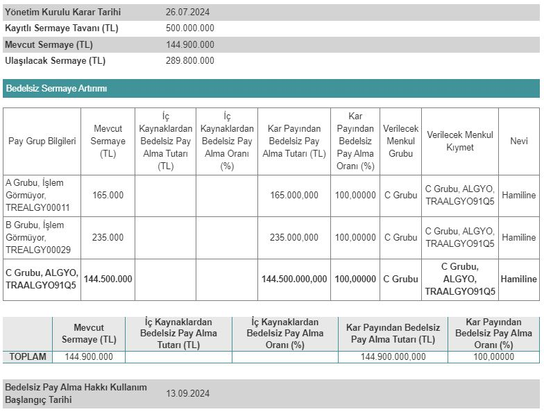

Alarko Gayrimenkul Yatırım Ortaklığı (ALGYO), 13.09.2024 tarihinde bedelsiz sermaye artırımına başlayacağını duyurdu. ALGYO hisseleri 13 Eylül tarihinde 2'ye bölünecek. 

Borsa İstanbuul pay piyasasında işlem gören gayrimenkul yatırım ortaklığı şirketlerinden Alarko Gayrimenkul Yatırım Ortaklığı A.Ş, %100 oranında bedelsiz sermaye artırımı kararı almıştı. Bu karar doğrultusunda Sermaye Piyasası Kurulu'na başvuruda bulunan şirket, geçtiğimiz hafta Kurul'dan onay almıştı.

Mevcut sermayesi 114.900.000 TL olan Alarko GYO, sermayesini 289.800.000 TL'ye çıkarıyor. Şirket, Kamuyu Aydınlatma Platformu'dan yaptığı açıklamada bedelsiz sermaye artırımının detaylarına da yer verdi. Alarko GYO, sermaye artırımına kullanılacak olan 144.900.000 TL'nin tamamınnı kâr payından karşılayacak.

**LOT SAYISI İKİ KATINA ÇIKACAK!**

Alarko GYO'nun sermaye artırımı sonrası Borsa İstanbul'da işlem gören lot sayısı 2 katına çıkacak. Şirketin yatırımcılarına %100 oranında bedelsiz pay dağıtımı gerçekleştirilecek. ALGYO hisse fiyatı da 2'ye bölünecek.