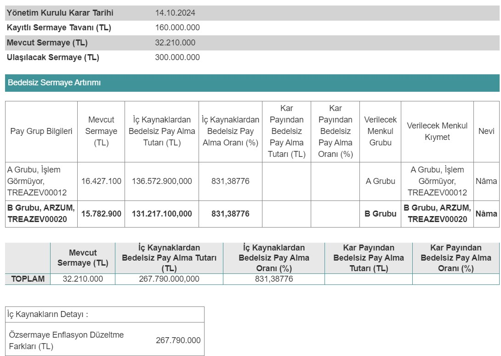

Borsa İstanbul şirketlerinden Arzum Ev Aletleri (ARZUM), yüzde 831,39 oranında bedelsiz sermaye artırımı kararı aldı. ARZUM bedelsiz ne zaman? ARZUM hisse ne zaman bölünecek?

Borsa İstanbul pay piyasasında işlem gören şirketlerden Arzum Ev Aletleri (ARZUM), 14.10.2024 tarihinde bedelsiz sermaye artırımı kararı aldı. Şirket yönetim kurulu tarafından alınan kararın detayları, Kamuyu Aydınlatma Platformu (KAP) üzerinden yatırımcılara duyuruldu. ARZUM’un bedelsiz sermaye artırımı ayrıntıları belli oldu!

Mevcut sermayesi 32.210.000 TL olan Arzum Ev Aletleri, %831,39 oranında bedelsiz ile birlikte sermayesini 300.000.000 TL’ye çıkarma kararı aldı. Şirketin kayıtlı sermaye tavanı ise 160.000.000 TL şeklinde dikkat çekiyor.

Arzum’un KAP açıklamasında bedelsiz sermaye artırımına kullanılacak olan fonun detayları da belli oldu. Şirket 267.790.000 TL tutarındaki fonun tamamını özsermaye enflasyon düzeltme farkları kaleminden karşılayacak.

Bedelsiz sermaye artırımı için Sermaye Piyasası Kurulu’na başvurusunu iletecek olan şirketin SPK’dan onay beklemesi gerekiyor. ARZUM’un bedelsiz sermaye artırımına onay alması durumunda haberimiz güncellenecektir.

