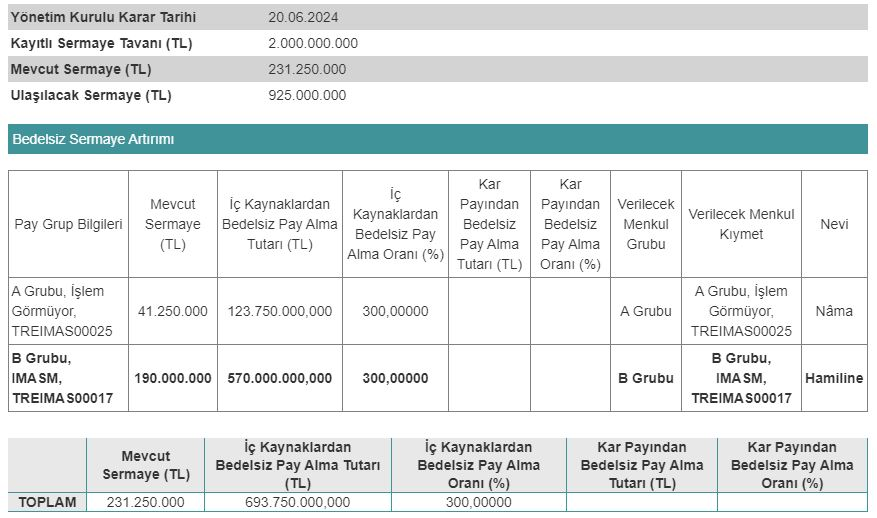
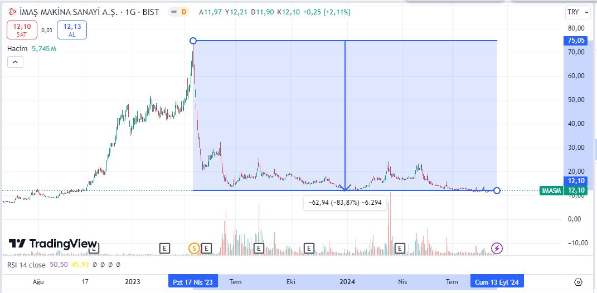

Geçtiğimiz yıl, yüzde 525 oranında bedelsiz sermaye artırımı yapan İmaş Makina (IMASM), bu yıl da yüzde 300 bedelsiz için onay aldı. IMASM hisseleri, önceki bedelsizden sonra yaklaşık yüzde 84 değer kaybetmişti.

Sermaye Piyasası Kurulu (SPK), 12 Eylül 2024 tarihli haftalık bültende İmaş Makina'nın bedelsiz sermaye artırımına onay verildiğini duyurdu. Mevcut sermayesi 231.250.000 TL olan İmaş Makina, önümüzdeki günlerde %300 oranında bedelsiz sermaye artırımı gerçekleştirecek. Şirket, bu işlemin ardından sermayesini 925.000.000 TL'ye çıkaracak. 

İmaş Makina, 2023 yılında da %525 oranında bedelsiz sermaye artırımı yapmıştı. Şirketin hisselerinde fiyat, o dönem tarihi zirvelerindeyken bedelsiz sonrası sert düşüş göstermişti. Yatırımcılarına ciddi oranda para kaybettiren IMASM hisseleri, gelinen noktada zirve fiyatından yaklaşık %84 aşağıda işlem görüyor.

### **SPK ONAYLADI, YAKINDA 4'E BÖLÜNECEK!**

Önceki bedelsiz sonrası yatırımcılarına adeta saç baş yolduran IMASM, bu kez de hisse fiyatında bir bölünmeye daha gidiyor. Hisse fiyatı 4'e bölünecek olan IMASM, yatırımcılarına da %300 oranında bedelsiz pay dağıtımı gerçekleştirecek. Daha önceki bedelsizin hisselerine olumsuz yansıdığı görülen IMASM'in bu kez nasıl bir performans göstereceği ise büyük bir endişeyle bekleniyor.