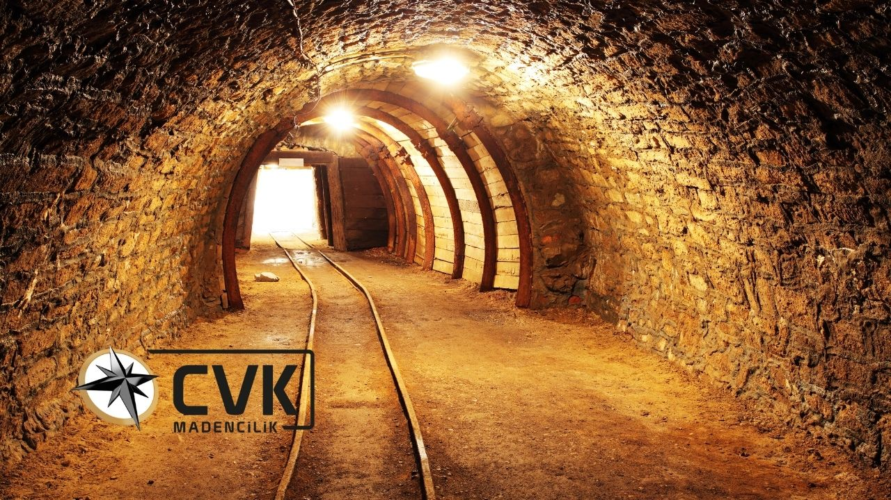
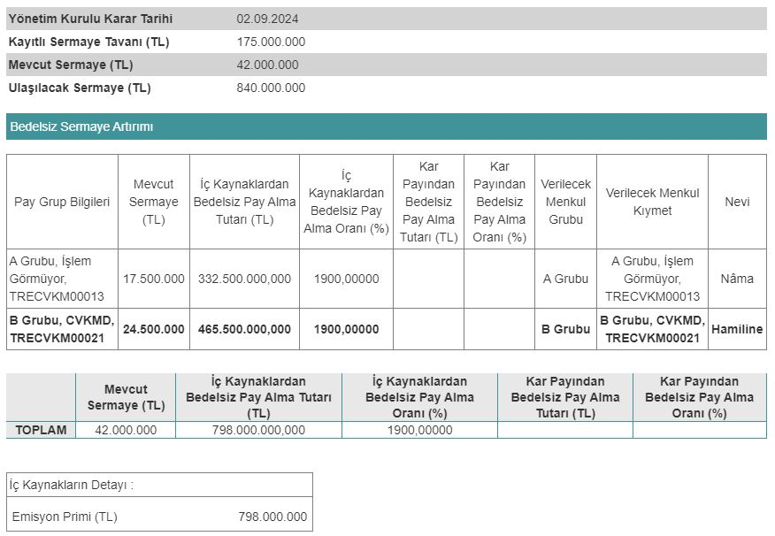

Borsa İstanbul şirketlerinden CVK Maden (CVKMD), 02.09.2024 tarihli yönetim kurulu toplantısında %1900 bedelsiz sermaye artırımı kararı aldı. Şirket, Sermaye Piyasası Kurulu'na başvurusunu iletti.

Mevcut sermayesi 42.000.000 TL olan CVK Maden, aldığı karar ile sermayesini 840.000.000 TL'ye çıkarmaya hazırlanıyor. Sermaye Piyasası Kurulu'na başvuruda bulunan şirket, Kamuyu Aydınlatma Platformu (KAP) üzerinden yapılan açıklamada, sermaye artırımına dair tüm detayları paylaştı.

CVK Maden, sermaye artırımında iç kaynaklardan 798.000.000 TL kullanacak. Şirket, bu fonun tamamını ise emisyon priminden karşılayacak. Bedelsiz sermaye artırımı kararı gelmesinin hemen ardından CVKMD yatırımcılar, bölünmenin ne zaman gerçekleştirileceği konusunu araştırmaya başladı.

## **CVKMD NE ZAMAN BÖLÜNECEK?**

CVK Maden (CVKMD) hisseleri, SPK onayının ardından bölünecek. Şirketin hissedarlarına %1900 bedelsiz pay dağıtımı yapılacak ve CVKDM hisse fiyatı 20'ye bölünecek. CVK Maden'in 2024 yılı 4. çeyreği ya da 2025 yılı 1. çeyreğinde bedelsiz onayı alması bekleniyor.