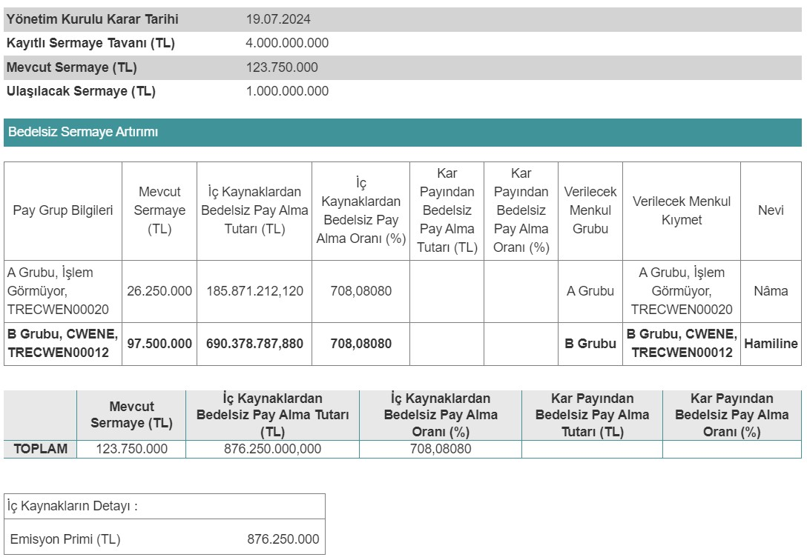

Borsa İstanbul şirketlerinden CW Enerji (CWENE), yüzde 708,08 oranında bedelsiz sermaye artırımı kararı aldı. CWENE ne zaman bölünecek? CW Enerji bedelsiz sermaye artırımı ne zaman?

CW Enerji (CWENE) Yönetim Kurulu, 19.07.2024 tarihinde %708,08 oranında bedelsiz sermaye artırımı kararı aldı. Şirket, Sermaye Piyasası Kurulu’na başvuruda bulundu.

Mevcut sermayesi 123.750.000 TL olan CW Enerji, yönetim kurulu kararı ile sermayesini 1.000.000.000 TL’ye çıkarmak için harekete geçti. Kamuyu Aydınlatma Platformu (KAP) üzerinden açıklamada bulunan CW Enerji, sermaye artırımında kullanılacak olan 876.250.000 TL’nin tamamının emisyon primi kaleminden karşılanacağını duyurdu.

Şirketin bedelsiz sermaye artırımı haberi sonrası yatırımcılar da bölünme tarihini merakla araştırmaya başladı. Halka arz sonrası yatırımcılarına kazandıran şirketlerden biri olan CW Enerji, son aylarda ise borsadaki düşüşü ile adından söz ettiriyor.

### **CWENE NE ZAMAN BÖLÜNECEK?**

CW Enerji’nin %708,08 oranında bedelsiz sermaye artırımının 2024 yılı 4. çeyreği ya da 2025 yılı 1. çeyreğinde tamamlanması bekleniyor. CW Enerji hisseleri SPK onayının ardından bölünecek.