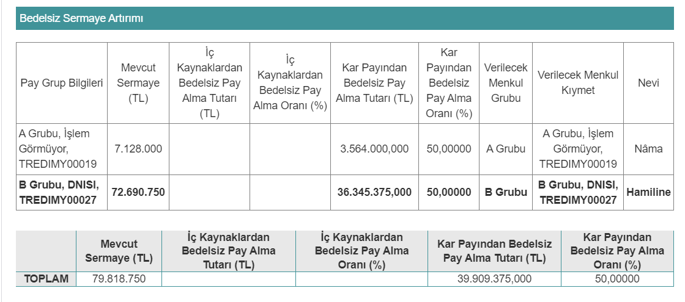

Payları Borsa İstanbul’da işlem gören **Dinamik Isı Makina Yalıtım Malzemeleri Sanayi ve Ticaret A.Ş.’**den bedelsiz sermaye artırımı kararı geldi. Şirket, söz konusu kararı Kamuoyu Aydınlatma Platformu (KAP) üzerinden duyurdu. DNISI ne zaman bölünecek, bedelsiz sermaye artırımı ne zaman?

Borsa İstanbul Ana Pazar’da payları işlem gören şirketlerinden biri olan Dinamik Isı, bedelsiz sermaye artırımı kararı aldı. Şirket, 18 Nisan tarihinde KAP üzerinden yapılan açıklamada, %50 oranında bedelsiz sermaye artırımı yapılacağını duyurdu.

**[100.000TL Sanal Para ile Borsayı Deneyin, Risk Almadan Deneme Hesabı ile Borsa İşlemlerini Keşfedin!](https://partners.gcmyatirim.com.tr/Tracking/S/641abf18ac688aed6aea3284)**

Dinamik Isı’nın **kayıtlı sermaye tavanı 700.000.000 TL** ve **mevcut sermayesi ise 79.818.750 TL** olarak dikkat çekiyor. Şirket, bedelsiz sermaye artırımı sonrası **sermayesini 119.728.125 TL’ye yükseltecek.** Bedelsiz sermaye artırımı, iç kaynaklardan kullanılacak ve **oranı** ise **%50** olarak duyuruldu. 

> **HATIRLATMA: Halka arz, sermaye artırımı ve borsa haberleri için mobil uygulamalarımızdan cihazınıza uygun olanı indirmeyi unutmayın. iOS ve Android uygulama linkleri, sayfanın en altında yer almaktadır.**

Dinamik Isı’dan yapılan açıklamada şu ifadeler kullanıldı:

“Şirketimiz Yönetim Kurululu'nun 18.04.2023 tarihli toplantısında;

Şirketimizin 06.04.2023 tarihinde yapılan 2022 Yılı Olağan Genel Kurul Toplantısı'nda alınan Şirketimizin çıkarılmış sermayesinin %50 oranında kar payının bedelsiz pay olarak pay sahiplerine dağıtılması kararı doğrultusunda;

Şirketimiz çıkarılmış sermayesinin, 700.000.000-TL kayıtlı sermaye tavanı içerisinde, 39.909.375-TL'lik artış ile 79.818.750-TL'den 119.728.125-TL'ye çıkartılmasına,

Artırılan 39.909.375-TL'nin 21.370.951,95 TL'sinin 2022 yılı karından, 18.538.423,05 TL'sinin geçmiş yıl karlarından karşılanmasına,

Sermaye artırımı nedeniyle ihraç edilecek bedelsiz payların, pay sahiplerine Şirket sermayesindeki mevcut payları oranında ve Sermaye Piyasası Mevzuatının kaydi sisteme ilişkin düzenlemeleri çerçevesinde usulüne uygun şekilde dağıtılmasına,

Bu karar kapsamında başta Sermaye Piyasası Kurulu olmak üzere, Merkezi Kayıt Kuruluşu A.Ş. ve diğer kuruluşlar nezdinde gerekli başvuruların yapılmasına ve bunun için gerekli tüm dokümanların hazırlanmasına, karar verilmiştir.”

**DİNAMİK ISI NE ZAMAN BÖLÜNECEK?**

Şirketin bedelsiz sermaye artırımı kararı Sermaye Piyasası Kurulu’na iletilecek. Söz konusu karar, Kurul’dan onay alması halinde ise bedelsiz bölünme gerçekleştirilecek. DNISI bedelsiz sermaye artırımının 2023 yılı ikinci yarısında gerçekleşmesi bekleniyor.