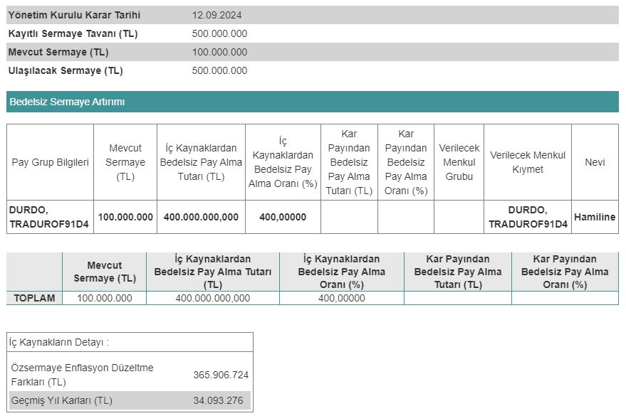

Borsa İstanbul şirketlerinden Duran Doğan Basım (DURDO), 12.09.2024 tarihinde yüzde 400 oranında bedelsiz sermaye artırımı kararı açıkladı.

Mevcut sermayesi 100.000.000 TL olan Duran Doğan Basım, Kamuyu Aydınlatma Platformu (KAP) üzerinden bedelsiz kararı duyurdu. Yönetim Kurulu Toplantısı'nda alınan kararın detaylarını paylaşan şirket, Sermaye Piyasası Kurulu'na %400 bedelsiz için başvuruda bulunulacağını belirtti. Duran Doğan Basım, SPK'dan onay alması halinde sermayesini 500.000.000 TL'ye çıkaracak.

Şirketin KAP açıklamasına göre, sermaye artırımında kullanılacak olan 400.000.000 TL'nin 365.906.724 TL'lik bölümünü özsermaye enflasyon düzeltme farkları kaleminden, 34.093.276 TL'si de geçmiş yıl kârları kaleminden karşılanacak.

## **DURDO BEDELSİZ NE ZAMAN?**

Duran Doğan Basım (DURDO) şirketinin, bedelsiz sermaye artırımına 2024 yılı dördüncü çeyreği ya da 2025 yılı birinci çeyreğinde onay alması bekleniyor. DURDO hisseleri SPK onayının ardından bölünecek.