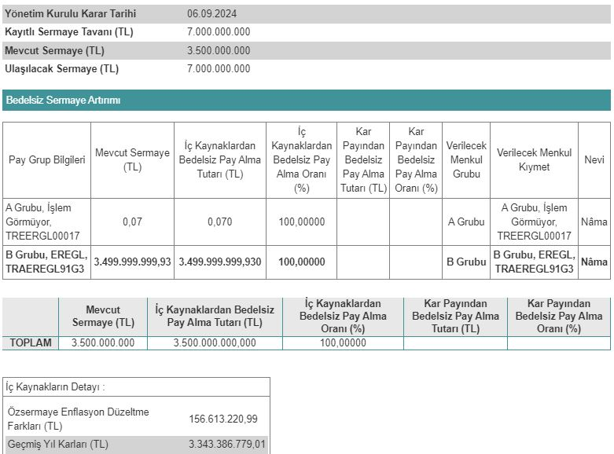

Ereğli Demir Çelik (EREGL), 06.09.2024 tarihinde yüzde 100 oranında bedelsiz sermaye artırımı kararı aldı. Şirketin 2024 yılında bölünme bekleniyor.

Borsa İstanbul'un önde gelen şirketlerinden Ereğli Demir Çelik (EREGL), sermaye artırımına gidiyor. Şirket yönetim kurulu Eylül ayında bir revize daha yayımladı. Ereğli Demir Çelik'ten yapılan açıklamada, bedelsiz sermaye artırımına konu edilen dağıtılabilir kaynaklarda değişiklik yapıldığı belirtildi.

Mevcut sermayesi 3.500.000.000 TL olan Ereğli Demir Çelik, sermayesini iki katına çıkararak 7.000.000.000 TL'ye yükseltecek. Şirket, bedelsiz sermaye artırımına konu edilen 3.500.000.000 TL'nin 156.613.220,99 TL'lik kısmını özsermaye enflasyon düzeltme farkları kaleminden, 3.343.386.779,01 TL'lik kısmını ise geçmiş yıl kârlarından karşılayacak.

### **EREĞLİ (EREGL) BEDELSİZ NE ZAMAN?**

Ereğli Demir Çelik'in 2024 yılı son çeyreği ya da 2025 yılı ilk çeyreğinde bedelsiz sermaye artırımına onay alması bekleniyor. EREGL hisseleri ise SPK onayının ardından 2'ye bölünecek. Şirket, borsadaki yatırımcılarına %100 oranında bedelsiz pay dağıtımı gerçekleştirecek. Portföyünde EREGL hissesi bulunanların hisse sayısı ise 2 katına çıkacak.

### **ŞİRKETTEN AÇIKLAMA!**

Ereğli Demir Çelik, bedelsiz sermaye artırımına ilişkin Kamuyu Aydınlatma Platformu (KAP) üzerinden açıklamada bulundu. Şirketten yapılan KAP açıklamasında, "Şirketimizin çıkarılmış sermayesinin 3.500.000.000,00 TL'den 7.000.000.000,00 TL'ye artırılması kapsamında ihraç edilecek 3.500.000.000,00 TL tutarındaki bedelsiz sermaye artırımına konu dağıtılabilir kaynaklarda nevi değişikliği gerçekleştirilmiştir. Bedelsiz sermaye artırımına konu dağıtılabilir kaynaklardaki nevi değişikliği sonrasında, 3.500.000.000,00 TL tutarındaki bedelsiz sermaye artırımının; 156.613.220,99 TL'sinin sermaye düzeltme farklarından, 3.343.386.779,01 TL'sinin geçmiş yıl karları içerisindeki olağanüstü yedeklerden karşılanmasına karar verilmiştir." ifadeleri yer aldı.