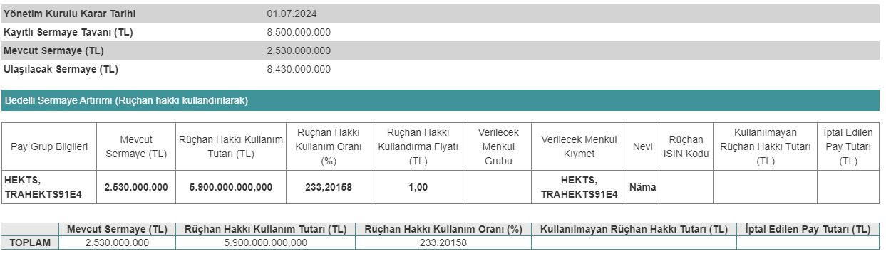

Sermaye Piyasası Kurulu (SPK), 12.09.2024 tarihinde Hektaş'ın bedelli sermaye artırımına onay verdi. HEKTS hisseleri için önümüzdeki tarihlerde, 15 günlük halka arz süreci başlayacak.

Borsa İstanbul'un köklü şirketlerinden biri olan Hektaş Ticaret T.A.Ş. (HEKTS), 01.07.2024 tarihinde bedelli sermaye artırımı kararı almıştı. Sermaye Piyasası Kurulu, 12 Eylül 2024 tarihli SPK bülteninde, Hektaş'ın bedellisine onay verdi.

Mevcut sermayesi 2.530.000.000 TL olan Hektaş, %233,20 oranında bedelli sermaye artırımı yapacak. Şirket, bu sermaye artırımı ile birlikte sermayesini 8.430.000.000 TL'ye çıkaracak. Hektaş'ın bedelli sermaye artırımında rüçhan hakkı kullandırma fiyatının 1 TL olduğu açıklandı.

Hektaş'ın bedelli sermaye artırımının nasıl işleyeceği konusu, yatırımcılar tarafından merak ediliyor. Rüçhan hakkının nasıl kullanılacağı ve bedelli sermaye artırımı sürecini birlikte inceleyelim.

## **HEKTAŞ (HEKTS) BEDELLİ NE ZAMAN?**

Hektaş, bedelli sermaye artırımı için önümüzdeki günlerde 15 günlük bir takvim açıklayacak. Şirket, borsada halka arz yolu ile bedelli sermaye artırımı gerçekleştirecek. Hektaş'ın bedelli sermaye artırımı tarihleri açıklandığında, aşağıda linkleri bulunan mobil uygulamalarımızdan bildirim gönderilecektir.

### **RÜÇHAN HAKKI NASIL KULLANILIR?**

Sermaye artırımı öncesinde elinde HEKTS hissesi bulunan yatırımcılara, bedelli tarihlerinin ilk günü rüçhan kuponu gönderilecek. Yatırımcıların bu rüçhan kuponlarını ya tanesi 1 TL'den hisse senedine çevirmesi ya da bir başka yatırımcıya ücreti karşılığında devretmesi gerekiyor. Aksi takdirde, her iki işlemi de yapmayan yatırımcılar, maddi zarara uğrayabilir.