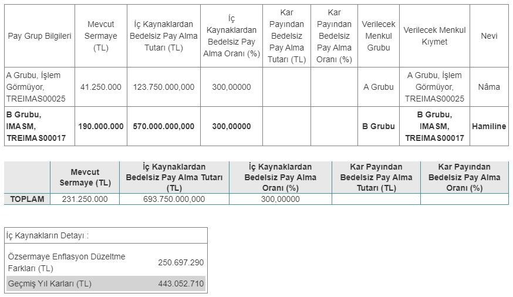

Sermaye Piyasası Kurulu (SPK), 12.09.2024 tarihinde İmaş Makina'nın (IMASM) yüzde 300 bedelsiz sermaye artırımını onayladı. IMASM hisseleri 16-20 Eylül haftasında 4'e bölünecek.

Mevcut sermayesi 231.250.000 TL olan İmaş Makina, 20 Haziran 2024 tarihli yönetim kurulu toplantısında bedelsiz sermaye artırımı kararı almıştı. Şirket, %300 bedelsiz sermaye artırımı ile sermayesini 925.000.000 TL'ye çıkaracak. SPK'dan onay alan İmaş Makina, sermaye artırımında kullanılacak 693.750.000 TL fonun 250.697.290 TL'sini özsermaye enflasyon düzeltme farkları kaleminden, 443.052.710 TL'sini de geçmiş yıl kârları kaleminden karşılayacak.

## **IMASM HİSSE NE ZAMAN BÖLÜNECEK?**

İmaş Makina hisseleri, 16-20 Eylül 2024 haftasında 4'e bölünecek. Şirketin hissedarlarına %300 oranında bedelsiz pay dağıtımı yapılacak.

### **LOT SAYISI 4 KATINA ÇIKACAK!**

İmaş Makina'nın bedelsiz sermaye artırımında lot sayısı 4 katına çıkacak. Örneğin, portföyünde 100 IMASM olan bir yatırımcının lot sayısı, sermaye artırımı sonrası 400'e çıkacak. IMASM hisse fiyatı 4'e bölüneceğinden dolayı, kâr-zarar durumunda herhangi bir değişiklik olmayacak.