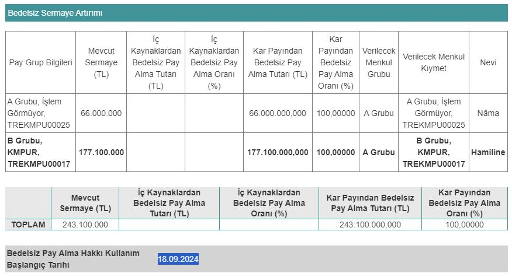

Kimteks Poliüretan (KMPUR), yüzde 100 oranında bedelsiz sermaye artırımına, 18.09.2024 tarihinde başlanacağını duyurdu. KMPUR hisseleri aynı tarihte bölünecek ve yatırımcılara yüzde 100 bedelsiz pay dağıtımı yapılacak.

Kimteks Poliüretan Yönetim Kurulu tarafından yapılan toplantıda, %100 bedelsiz sermaye artırımı kararı alınmıştı. Mevcut sermayesi 243.100.000 TL olan Kimteks, sermayesini 486.200.000 TL'ye çıkaracak. Sermaye Piyasası Kurulu onayının ardından şirketin bedelsizine dair tüm detaylar da belli oldu.

Kimteks Poliüretan, sermaye artırımına konu edilen 243.100.000 TL'nin tamamını kâr payından karşılayacak. Şirketin hissedarlarında %100 oranında bedelsiz pay dağıtımı yapılacak. KMPUR hisselerinde fiyat ise 2'ye bölünecek.

### **KAP AÇIKLAMASI!**

Kimteks Poliüretan, bedelsiz sermaye artırımına ilişkin açıklamada bulundu. Şirketten yapılan KAP açıklamasında, ***"Şirketimiz sermayesinin, tamamı 2023 yılı net karından karşılanmak suretiyle, 486.200.000 TL'ye artırılması nedeniyle ihraç edilecek 243.100.000 TL'lik itibari değerdeki paylara ilişkin İhraç Belgesinin onaylanmasına ve Esas Sözleşmenin "Sermaye" başlıklı 6. maddesinin tadil edilmesine ilişkin başvurumuz SPK tarafından onaylanmış olup, karar SPK'nın 12/09/2024 tarih ve 2024/47 sayılı bülteninde yayımlanmıştır. Onaylı İhraç Belgesi ve Esas Sözleşme Tadil Metni ekte sunulmaktadır. Bedelsiz pay alma hakkı kullanım başlangıç tarihi 18/09/2024'tür. Kamuoyunun ve yatırımcılarımızın bilgisine sunarız."*** ifadeleri yer aldı.