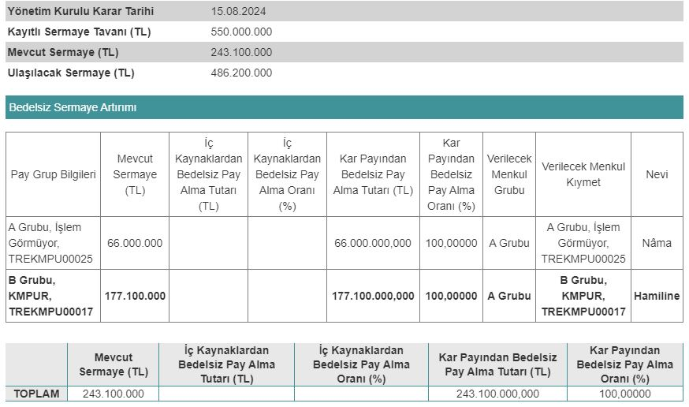

Sermaye Piyasası Kurulu (SPK), 12.09.2024 tarihinde Kimteks Poliüretan'ın (KMPUR) bedelsiz sermaye artırımını onayladı. Şirketin hisseleri 18 Eylül 2024 tarihli seansta bölünecek.

Kimteks Poliüretan, Yönetim Kurulu Toplantısı'nda %100 oranında bedelsiz sermaye kararı almıştı. Mevcut sermayesi 243.100.000 TL olan Kimteks, sermayesini 486.200.000 TL'ye çıkarıyor. Sermaye Piyasası Kurulu'na başvurusunu ileten şirket, yaptığı başvuruya geçtiğimiz gün onay aldı.

İç kaynaklardan bedelsiz sermaye artırımı yapacak olan Kimteks Poliüretan, 243.100.000 TL'nin tamamını kâr payından karşılayacak. Şirketin SPK onayı almasının ardından yatırımcılar ise bedelsiz bölünmenin ne zaman gerçekleşeceği konusunu araştırıyor.

