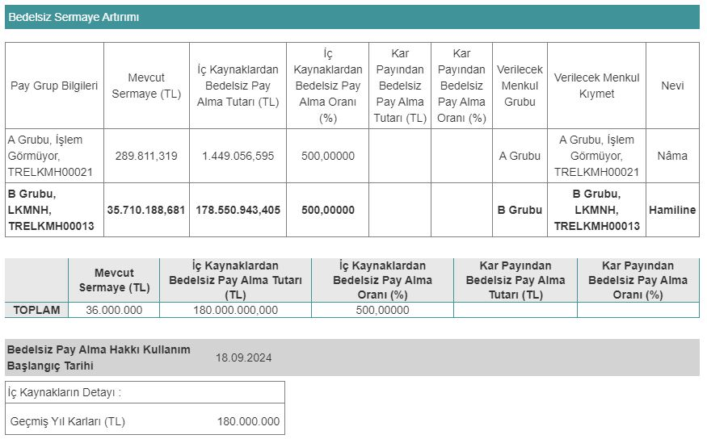

Borsa İstanbul şirketlerinden Lokman Hekim Sağlık (LKMNH), yüzde 500 bedelsiz sermaye artırımı yapacak. LKMNH hisseleri, 18 Eylül 2024 tarihinde bölünecek.

Mevcut sermayesi 36.000.000 TL olan Lokman Hekim, 10 Haziran 2024 tarihli yönetim kurulu toplantısında bedelsiz sermaye artırımı kararı almıştı. Şirket, sermayesini 216.000.000 TL'ye çıkarmak için Sermaye Piyasası Kurulu'ndan onay aldı. SPK onayının ardından Lokman Hekim şirketinin bedelsizine dair detaylar da belli oldu.

Lokman Hekim'in Kamuyu Aydınlatma Platformu'ndan yaptığı açıklamada, 18 Eylül'de bedelsiz sermaye artırımına başlanacağı belirtildi. Şirket, bedelsiz sermaye artırımında kullanılacak olan 180.000.000 TL'nin tamamını geçmiş yıl kârlarından karşılayacak.

### **LOT SAYISI 6 KATINA ÇIKACAK!**

Lokman Hekim Sağlık'ın Borsa İstanbul'da işlem gören lot sayısı, bu bedelsiz ile birlikte 6 katına çıkacak. Şirketin yatırımcılarına da %500 oranında bedelsiz pay dağıtımı yapılacak. LKMNH hisse fiyatı ise 6'ya bölünecek. LKMNH yatırımcılarının lot sayısının artması dışında, kâr-zarar durumunda herhangi bir değişiklik olmayacak.

### **KAP AÇIKLAMASI**

Lokman Hekim Sağlık, bedelsiz sermaye artırımına ilişkin KAP üzerinden yaptığı açıklamada şu ifadelere yer verdi:

***"Şirketimizin 36.000.000 TL olan çıkarılmış sermayesinin kar dağıtımı kapsamında 180.000.000 TL (%500) bedelsiz artırılarak 216.000.000 TL'ye çıkarılmasına ilişkin hak kullanım başlangıç tarihi 18.09.2024 olarak belirlenmiştir."***