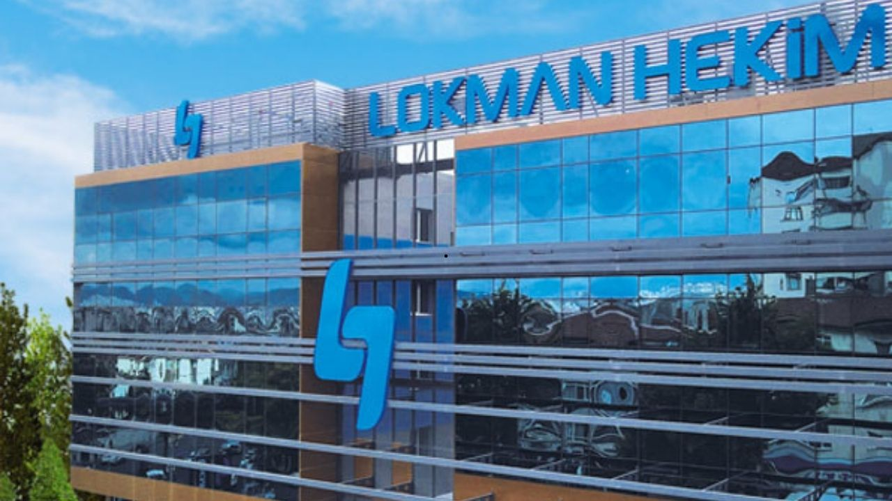
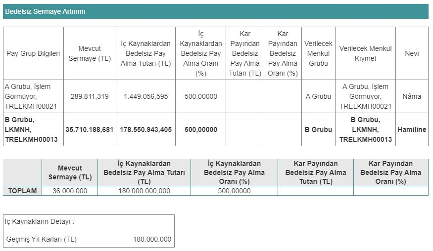

Sermaye Piyasası Kurulu (SPK), 12.09.2024 tarihinde Lokman Hekim'in (LKMNH) yüzde 500 bedelsiz sermaye artırımını onayladı. LKMNH hisseleri, 18 Eylül 2024 Çarşamba günü bölünecek.

Mevcut sermayesi 36.000.000 TL olan Lokman Hekim Engürüsağ Sağlık (LKMNH), 10 Haziran 2024 tarihinde %500 bedelsiz sermaye artırımı kararı almıştı. Sermaye Piyasası Kurulu'na başvuruda bulunan şirketin başvurusu onaylandı. Lokman Hekim, bedelsiz ile birlikte sermayesini 216.000.000 TL'ye çıkaracak.

Lokman Hekim'in bedelsiz sermaye artırımında iç kaynaklardan kullanacağı 180.000.000 TL'nin tamamı geçmiş yıl kârlarından karşılanacak. Şirketin bedelsiz sermaye artırımında lot sayısı 6 katına yükselecek.

### **100 LOT 600 OLACAK!**

Lokman Hekim'in sermaye artırımında şirketin paydaşları da bu işlemden yararlanacak. Örneğin; 100 LKMNH hissesi olan bir yatırımcının lot sayısı, belirlenecek olan tarihte 600'e yükselecek. Lokman Hekim'in borsada işlem gören hisse fiyatı ise 6'ya bölünecek. Yatırımcıların kâr-zarar durumunda bir değişiklik olmayacak.