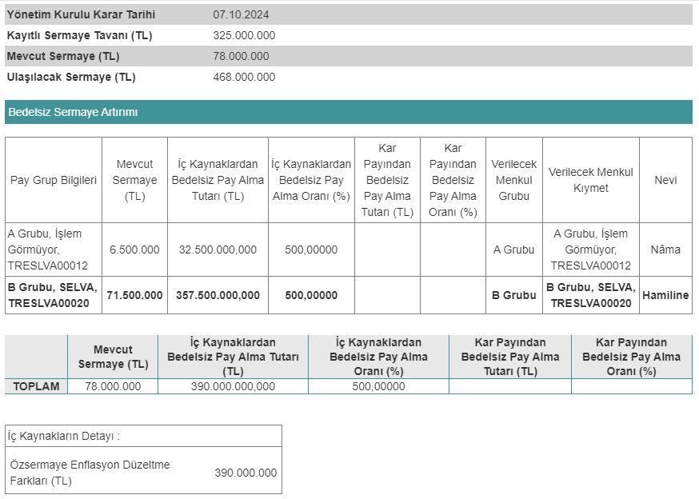

Borsa İstanbul'un gıda şirketlerinden Selva Gıda, 07.09.2024 tarihinde yüzde 500 bedelsiz sermaye artırımı kararı açıkladı. SELVA ne zaman bölünecek? İşte detaylar!

Borsa İstanbul pay piyasasında işlem gören şirketlerden Selva Gıda, bedelsiz sermaye artırımına gidiyor. Mevcut sermayesi 78.000.000 TL olan şirket, sermayesini 468.000.000 TL'ye çıkarma kararı aldı. Selva Gıda'nın aldığı bu karar, Kamuyu Aydınlatma Platformu (KAP) üzerinden yatırımcılara duyuruldu. 

Bedelsiz sermaye artırımına ilişkin detaylara da yer veren Selva Gıda'nın fon kullanım alanları belli oldu. Şirket, sermaye artırımına konu edilen 390.000.000 TL'nin tamamını özsermaye enflasyon düzeltme farkları kaleminden karşılayacak.

### **SELVA NE ZAMAN BÖLÜNECEK?**

Selva Gıda'nın bedelsiz sermaye artırımı, Sermaye Piyasası Kurulu'ndan onay bekliyor. Şirketin 2025 yılında bölünmesi bekleniyor. SELVA hisseleri bu bedelsiz ile birlikte 6'ya bölünecek ve yatırımcılara %500 oranında bedelsiz pay dağıtımı yapılacak.