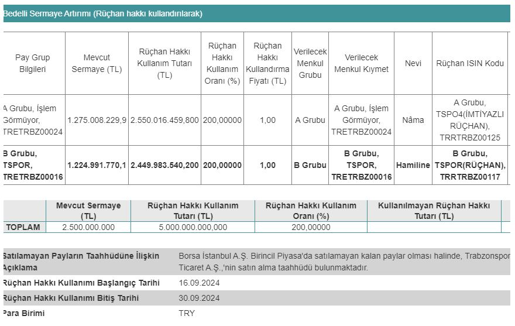

Borsa İstanbul şirketlerinden Trabzonspor (TSPOR), bedelli sermaye artırımının 16-30 Eylül 2024 tarihleri arasında gerçekleştirileceğini açıkladı. Şirket, bu tarihler arasında yüzde 200 oranında rüçhan hakkı kullandıracak.

Mevcut sermayesi 2.500.000.000 TL olan Trabzonspor, 26.08.2024 tarihinde bedelli sermaye artırımı için karar almıştı. Sermaye Piyasası Kurulu'na başvuruda bulunan şirket, geçtiğimiz gün yayımlanan SPK Bülteni'nde sermaye artırımına onay aldı. Trabzonspor, %200 bedelli sermaye artırımı ile birlikte sermayesini 7.500.000.000 TL'ye çıkaracak. Trabzonspor'un bedelli sermaye artırımında rüçhan hakkı kullandırma fiyatının 1 TL olduğu duyuruldu.

## **HİSSE FİYATI 3'E BÖLÜNECEK!**

Trabzonspor'un bedelli sermaye artırımında lot sayısı 3'e katlanacak. TSPOR hisse fiyatı da 3'e bölünecek. Yatırımcıların bu bedelli sermaye artırımına katılabilmesi için her bir rüçhan kuponu başına 2 TL ödeyerek bedelli sermaye artırımına katılması gerekiyor. Bedelli sermaye artırımına katılmak istemeyen yatırımcılar ise rüçhan kuponlarını 16-30 Eylül tarihleri arasında piyasa fiyatından başka bir yatırımcıya devredebilecek.

### **TSPOR.R RÜÇHAN NASIL KULLANILIR?**

Trabzonspor'un bedelli sermaye artırımı başlangıcı olan 16.09.2024 tarihinde, yatırımcılara hisse başına 1 rüçhan kuponu gönderilecek. Örneğin; 100 TSPOR hissesi olan bir yatırımcıya, 100 tane de TSPOR.R (rüçhan kuponu) tahsis edilecek. Yatırımcılar, bedelli oranı %200 olduğu için her bir rüçhan başına 2 TL ödeyerek, yani 100 rüçhan için toplam 200 TL ödeyerek rüçhan kuponlarını hisse senedine çevirebilecek. Bu işlem için son tarih ise 30.09.2024 olacak.