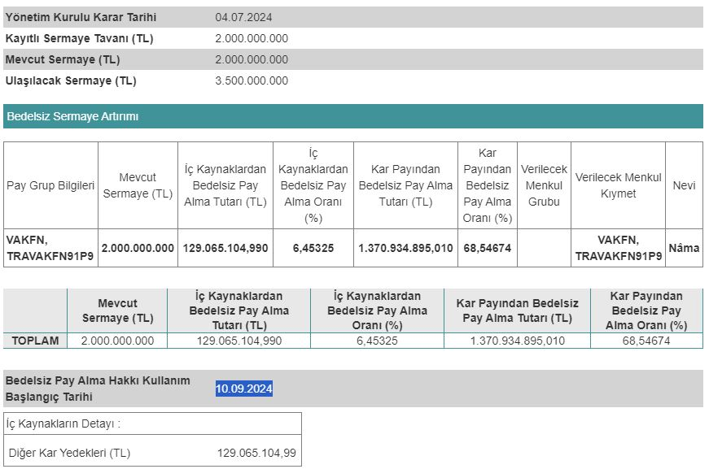

Vakıf Finansal Kiralama (VAKFN), 10.09.2024 tarihinde bedelsiz sermaye artırımı gerçekleştirileceğini duyurdu. Şirket, yatırımcılarına %75 oranında bedelsiz pay dağıtımı yapacak. VAKFN hisseleri de aynı tarihte bölünecek.

Mevcut sermayesi 2.000.000.000 TL olan Vakıf Finansal Kiralama (VAKFN), 04.07.2024 tarihli yönetim kurulu toplantısında bedelsiz sermaye artırımı kararı almıştı. Bu karar doğrultusunda Sermaye Piyasası Kurulu'na başvuruda bulunan şirket, geçtiğimiz hafta SPK'dan onay aldı. 

Sermaye Piyasası Kurulu, 05.09.2024 tarihli haftalık bülteninde VAKFN %75 bedelsiz sermaye artırımına onay verdi. Şirket, alınan onayla birlikte sermayesini 3.500.000.000 TL'ye çıkaracak. Vakıf Finansal Kiralama, sermaye artırımında kullanılacak olan 1.500.000.000 TL'nin 129.065.104,99 TL'lik kısmını diğer kâr yedeklerinden, 1.370.934.895,010 TL'lik kısmını da kâr payından karşılayacak.

### **VAKFN NE ZAMAN BÖLÜNECEK?**

Vakıf Finansal Kiralama (VAKFN) hisseleri, 10.09.2024 tarihinde bölünecek. Şirket, yatırımcılarına aynı tarihte bedelsiz pay dağıtımlarını gerçekleştirecek.