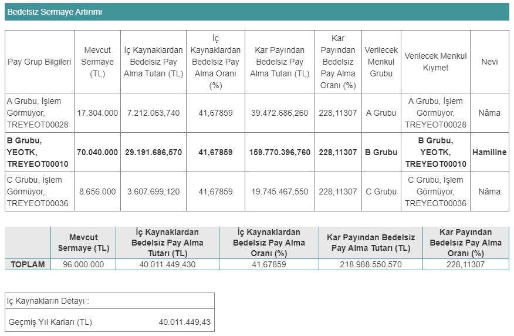

Yeo Teknoloji (YEOTK), 14.06.2024 tarihli yönetim kurulu toplantısında yüzde 269,79 oranında bedelsiz sermaye artırımı kararı aldı. YEOTK hisseleri, SPK onayının ardından bölünecek.

Enerji sektörünün önde gelen şirketlerinden Yeo Teknoloji (YEOTK), bir kez daha bedelsiz kararı aldı. Şirket, halka arz edilmesinin ardından 2022 yılında %300 oranında bedelsiz sermaye artırımı gerçekleştirmişti. Haziran ayında Yeo Teknoloji Yönetim Kurulu toplanarak yeni bedelsiz kararını duyurdu. 

Mevcut sermayesi 96.000.000 TL olan Yeo Teknoloji, Sermaye Piyasası Kurulu'na %269,79'luk bedelsiz başvurusunda bulundu. Şirketin SPK'dan onay alması durumunda, yeni sermayesi 355.000.000 TL'ye yükselecek.

Kamuyu Aydınlatma Platformu (KAP) üzerinden açıklamada bulunan Yeo Teknoloji, bedelsiz sermaye artırımında 259.000.000 TL kullanılacağını açıkladı. Bu fonun 40.011.449,43 TL'si geçmiş yıl kârlarından, 218.988.550,57 TL'si kâr payından alınacak.

### **YEOTK NE ZAMAN BÖLÜNECEK?**

Yeo Teknoloji'nin, 2024 yılı 4. çeyreği ya da 2025 yılı 1. çeyreğinde bedelsiz sermaye artırımı için onay alması bekleniyor. Şirketin hisseleri, SPK onayının ardından bölünecek. Bedelsiz sermaye artırımı ile birlikte YEOTK yatırımcılarına da bedelsiz pay dağıtımı yapılacak.