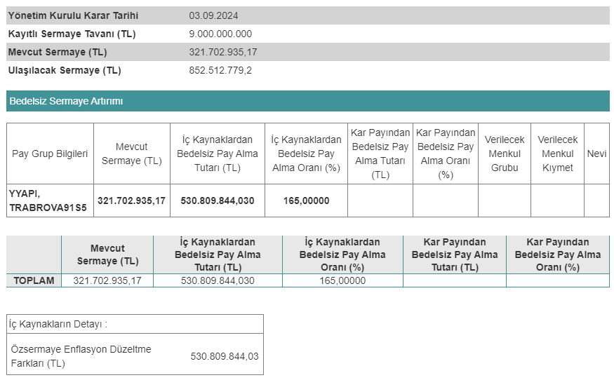

Yeşil Yapı Endüstrisi (YYAPI), 03.09.2024 tarihli KAP açıklamasında yüzde 165 oranında bedelsiz sermaye artırımı kararı duyurdu. YYAPI hisselerinin 2024 yılı 4. çeyreği ya da 2025 yılı 1. çeyreğinde bölünmesi bekleniyor.

Mevcut sermayesi 321.702.935,17 TL olan Yeşil Yapı Endüstrisi de bedelsiz sermaye artırımı kararı alan şirketlerden biri oldu. Sermaye Piyasası Kurulu'na başvurusunu ileten Yeşil Yapı Endüstrisi, onay alınması halinde sermayesini 852.512.779,2 TL'ye çıkaracak. Şirketin sermaye artırımı oranı ise %165 olacak.

Yeşil Yapı Endüstrisi, Kamuyu Aydınlatma Platformu (KAP) üzerinden yaptığı açıklamada bedelsiz sermaye artırımının detaylarını da paylaştı. Şirket, sermaye artırımında kullanılacak olan 530.809.844,03 TL'nin tamamının özsermaye enflasyon düzeltme farkları kaleminden karşılanacağını belirtti.

### **YYAPI NE ZAMAN BÖLÜNECEK?**

Yeşil Yapı Endüstrisi, bedelsiz sermaye artırımını SPK onayının ardından yapacak. Şirketin bu yılın son çeyreğinde ya da 2025 yılının 1. çeyreğinde SPK onayı alması ve bedelsiz sermaye artırımına başlaması bekleniyor.