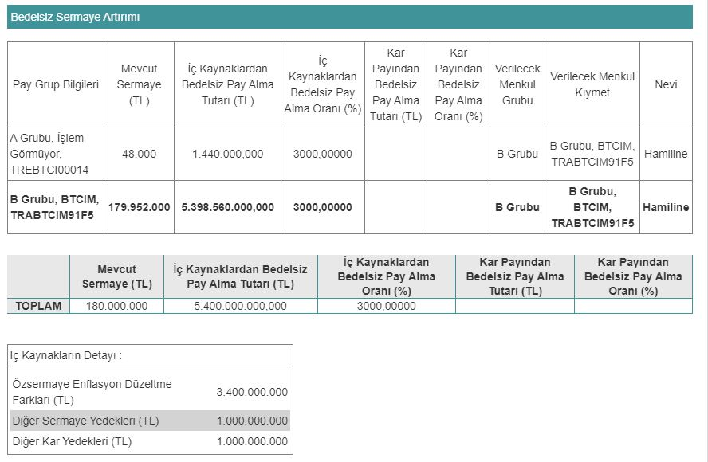

Borsa İstanbul pay piyasasında işlem gören çimento şirketlerinden Batıçim Batı Anadolu Çimento (BTCIM), yüzde 3000 oranında dev bedelsiz kararı aldı. Batıçim'in bedelsizinde 100 lotu olan yatırımcının lot sayısı, 3100'e yükselecek.

Kamuyu Aydınlatma Platformu (KAP) üzerinden açıklamada bulunan Batıçim Batı Anadolu Çimento, Sermaye Piyasası Kurulu'na %3000 bedelsiz sermaye artırımı için başvuruda bulunduğunu duyurdu. Şirketin mevcut sermayesi 180.000.000 TL iken, sermaye artırımına onay alması durumunda 5.580.000.000 TL'ye yükselecek.

Batıçim'in SPK onayının ardından yatırımcılara %3000'lik dev oranda bedelsiz pay dağıtımı yapılacak. Şirketin hisse fiiyatı ise 31'e bölünecek. Batıçim Batı Anadolu Çimento, bedelsiz sermaye artırımını iç kaynaklardan 5.400.000.000 kullanarak gerçekleştirecek.

Şirketin KAP'ta yaptığı duyuruda, bu fonun 3.400.000.000 TL'sinin özsermaye enflasyon düzeltme farkları kaleminden, 1.000.000.000 TL'sinin diğer sermaye yedeklerinden, 1.000.000.000 TL'sinin de diğer kâr yedeklerinden karşılanacağı belirtildi.

### **100 LOT 3100'E YÜKSELECEK**

Batıçim Batı Anadolu Çimento'nun bedelsiz sermaye artırımında, örneğin 100 BTCIM hissesi olan bir yatırımcının lot sayısı 3100'e yükselecek. Şirketin hisse fiyatı bölüneceğinden dolayı, yatırımcıların kâr-zarar durumunda bir değişiklik olmayacak.