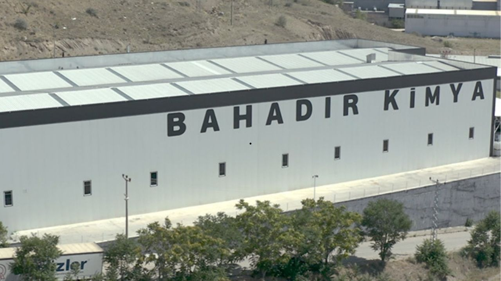

Borsa İstanbul'un yeni halka arz şirketlerinden biri olan Bahadır Kimya (BAHKM), yeni iş anlaşması açıkladı.

Kamuyu Aydınlatma Platformu (KAP) üzerinden açıklamada bulunan Bahadır Kimya (BAHKM), halka arz öncesi ticareti bulunan bir müşterisinden yeni sipariş alındığını duyurdu. Şirketten yapılan açıklamada yeni sipariş bedelinin 818 bin dolarlık sipariş alındığını ve 134 bin dolarlık avans bedelinin de taraflarına aktarıldığı belirtildi.

Bahadır Kimya'nın açıklamasında şu ifadelere yer verildi:

***"Şirketimiz, halka arzından önce yurt dışında yerleşik bir müşterisinden 1.406.000 (Birmilyondörtyüzaltıbin USD) sipariş alınmıştı. Bugün aynı müşteriden ilave olarak 818.000 (Sekizyüzonsekizbin USD) ürün siparişi almıştır. Bu kez alınan siparişin 134.000 (Yüzotuzdörtbin USD) avans bedeli şirketimizin banka hesabına yatırılmıştır.***

***Kamuya saygıyla duyurulur."***